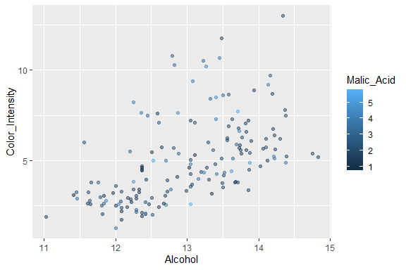

Business Intelligence Lab 7
================
Chicken-nuggets
30th october 2023

- [Student Details](#student-details)

# Student Details

<table style="width:90%;">
<colgroup>
<col style="width: 45%" />
<col style="width: 44%" />
</colgroup>
<tbody>
<tr class="odd">
<td><strong>Student ID Number and Name</strong></td>
<td><ol type="1">
<li>137118 Fatoumata Camara</li>
<li>127039 Ayan Ahmed</li>
<li>136869 Birkanwal Bhambra</li>
<li>127602 Trevor Anjere</li>
<li>133824 Habiba Siba</li>
</ol></td>
</tr>
<tr class="even">
<td><strong>BBIT 4.2 Group</strong></td>
<td>Chicken-nuggets</td>
</tr>
</tbody>
</table>

``` r
if (require("stats")) {
  require("stats")
} else {
  install.packages("stats", dependencies = TRUE,
                   repos = "https://cloud.r-project.org")
}

if (require("corrplot")) {
  require("corrplot")
} else {
  install.packages("stats", dependencies = TRUE,
                   repos = "https://cloud.r-project.org")
}
```

    ## Loading required package: corrplot

    ## corrplot 0.92 loaded

``` r
## mlbench 
if (require("mlbench")) {
  require("mlbench")
} else {
  install.packages("mlbench", dependencies = TRUE,
                   repos = "https://cloud.r-project.org")
}
```

    ## Loading required package: mlbench

``` r
## caret 
if (require("caret")) {
  require("caret")
} else {
  install.packages("caret", dependencies = TRUE,
                   repos = "https://cloud.r-project.org")
}
```

    ## Loading required package: caret

    ## Loading required package: ggplot2

    ## Loading required package: lattice

``` r
## MASS 
if (require("MASS")) {
  require("MASS")
} else {
  install.packages("MASS", dependencies = TRUE,
                   repos = "https://cloud.r-project.org")
}
```

    ## Loading required package: MASS

``` r
## glmnet 
if (require("glmnet")) {
  require("glmnet")
} else {
  install.packages("glmnet", dependencies = TRUE,
                   repos = "https://cloud.r-project.org")
}
```

    ## Loading required package: glmnet

    ## Loading required package: Matrix

    ## Loaded glmnet 4.1-8

``` r
## e1071 
if (require("e1071")) {
  require("e1071")
} else {
  install.packages("e1071", dependencies = TRUE,
                   repos = "https://cloud.r-project.org")
}
```

    ## Loading required package: e1071

``` r
## kernlab 
if (require("kernlab")) {
  require("kernlab")
} else {
  install.packages("kernlab", dependencies = TRUE,
                   repos = "https://cloud.r-project.org")
}
```

    ## Loading required package: kernlab

    ## 
    ## Attaching package: 'kernlab'

    ## The following object is masked from 'package:ggplot2':
    ## 
    ##     alpha

``` r
## rpart 
if (require("rpart")) {
  require("rpart")
} else {
  install.packages("rpart", dependencies = TRUE,
                   repos = "https://cloud.r-project.org")
}
```

    ## Loading required package: rpart

``` r
if (require("arules")) {
  require("arules")
} else {
  install.packages("arules", dependencies = TRUE,
                   repos = "https://cloud.r-project.org")
}
```

    ## Loading required package: arules

    ## 
    ## Attaching package: 'arules'

    ## The following object is masked from 'package:kernlab':
    ## 
    ##     size

    ## The following objects are masked from 'package:base':
    ## 
    ##     abbreviate, write

``` r
## arulesViz ----
if (require("arulesViz")) {
  require("arulesViz")
} else {
  install.packages("arulesViz", dependencies = TRUE,
                   repos = "https://cloud.r-project.org")
}
```

    ## Loading required package: arulesViz

``` r
## tidyverse ----
if (require("tidyverse")) {
  require("tidyverse")
} else {
  install.packages("tidyverse", dependencies = TRUE,
                   repos = "https://cloud.r-project.org")
}
```

    ## Loading required package: tidyverse

    ## ── Attaching core tidyverse packages ──────────────────────── tidyverse 2.0.0 ──
    ## ✔ dplyr     1.1.3     ✔ readr     2.1.4
    ## ✔ forcats   1.0.0     ✔ stringr   1.5.0
    ## ✔ lubridate 1.9.3     ✔ tibble    3.2.1
    ## ✔ purrr     1.0.2     ✔ tidyr     1.3.0
    ## ── Conflicts ────────────────────────────────────────── tidyverse_conflicts() ──
    ## ✖ kernlab::alpha() masks ggplot2::alpha()
    ## ✖ purrr::cross()   masks kernlab::cross()
    ## ✖ tidyr::expand()  masks Matrix::expand()
    ## ✖ dplyr::filter()  masks stats::filter()
    ## ✖ dplyr::lag()     masks stats::lag()
    ## ✖ purrr::lift()    masks caret::lift()
    ## ✖ tidyr::pack()    masks Matrix::pack()
    ## ✖ dplyr::recode()  masks arules::recode()
    ## ✖ dplyr::select()  masks MASS::select()
    ## ✖ tidyr::unpack()  masks Matrix::unpack()
    ## ℹ Use the conflicted package (<http://conflicted.r-lib.org/>) to force all conflicts to become errors

``` r
## readxl ----
if (require("readxl")) {
  require("readxl")
} else {
  install.packages("readxl", dependencies = TRUE,
                   repos = "https://cloud.r-project.org")
}
```

    ## Loading required package: readxl

``` r
## lubridate
if (require("lubridate")) {
  require("lubridate")
} else {
  install.packages("lubridate", dependencies = TRUE,
                   repos = "https://cloud.r-project.org")


## plyr 
if (require("plyr")) {
  require("plyr")
} else {
  install.packages("plyr", dependencies = TRUE,
                   repos = "https://cloud.r-project.org")
}


## dplyr ----
if (require("dplyr")) {
  require("dplyr")
} else {
  install.packages("dplyr", dependencies = TRUE,
                   repos = "https://cloud.r-project.org")
}

## naniar ----
if (require("naniar")) {
  require("naniar")
} else {
  install.packages("naniar", dependencies = TRUE,
                   repos = "https://cloud.r-project.org")
}

## RColorBrewer ----
if (require("RColorBrewer")) {
  require("RColorBrewer")
} else {
  install.packages("RColorBrewer", dependencies = TRUE,
                   repos = "https://cloud.r-project.org")}
}
```

``` r
# Loading and splitting the dataset
library(readr)
Loan_Default <- read_csv("data/Loan_Default.csv", 
    col_types = cols(Employed = col_factor(levels = c("1", 
        "0")), Default = col_factor(levels = c("1", 
        "0"))))
View(Loan_Default) 

# An 80:20 split of the dataset
train_index <- createDataPartition(Loan_Default$Default,
                                   p = 0.8,
                                   list = FALSE)
Loan_Default_train <- Loan_Default[train_index, ]
Loan_Default_test <- Loan_Default[-train_index, ]

#Training the model
Loan_Default_model_glm <- glm(Default ~ ., data = Loan_Default_train,
                          family = binomial(link = "logit"))

# Displaying the model's details
print(Loan_Default_model_glm)
```

    ## 
    ## Call:  glm(formula = Default ~ ., family = binomial(link = "logit"), 
    ##     data = Loan_Default_train)
    ## 
    ## Coefficients:
    ##     (Intercept)            Index        Employed0   `Bank Balance`  
    ##       1.068e+01        3.774e-05        5.248e-01       -4.717e-04  
    ## `Annual Salary`  
    ##      -4.356e-07  
    ## 
    ## Degrees of Freedom: 8000 Total (i.e. Null);  7996 Residual
    ## Null Deviance:       2341 
    ## Residual Deviance: 1268  AIC: 1278

``` r
# Making predictions on the test data
probabilities <- predict(Loan_Default_model_glm, Loan_Default_test, type = "response")
print(probabilities)
```

    ##          1          2          3          4          5          6          7 
    ## 0.99852273 0.99855148 0.98040072 0.99909891 0.99997011 0.99949783 0.99981271 
    ##          8          9         10         11         12         13         14 
    ## 0.93390204 0.99852024 0.99979834 0.99886301 0.98023396 0.99841314 0.99220932 
    ##         15         16         17         18         19         20         21 
    ## 0.99997118 0.99852976 0.89763596 0.99991347 0.99686776 0.99943574 0.99547171 
    ##         22         23         24         25         26         27         28 
    ## 0.99773839 0.94818281 0.99988343 0.99630139 0.99968347 0.99962172 0.99845044 
    ##         29         30         31         32         33         34         35 
    ## 0.99970585 0.93700702 0.99961800 0.99979327 0.99906088 0.95586314 0.99996392 
    ##         36         37         38         39         40         41         42 
    ## 0.99966431 0.99786435 0.96202592 0.99764246 0.99595461 0.70994104 0.99539861 
    ##         43         44         45         46         47         48         49 
    ## 0.99877363 0.88690756 0.97662151 0.99988142 0.92284542 0.99361835 0.99997189 
    ##         50         51         52         53         54         55         56 
    ## 0.99935452 0.99995959 0.99557023 0.99234801 0.99919562 0.99846170 0.99277194 
    ##         57         58         59         60         61         62         63 
    ## 0.98949014 0.99724408 0.99964602 0.98937871 0.98910312 0.71814581 0.99831205 
    ##         64         65         66         67         68         69         70 
    ## 0.99978668 0.99909819 0.98566929 0.75932748 0.99366576 0.99978255 0.98226545 
    ##         71         72         73         74         75         76         77 
    ## 0.89081230 0.99989897 0.97257747 0.99993105 0.99421291 0.99120005 0.99886492 
    ##         78         79         80         81         82         83         84 
    ## 0.99843125 0.99880618 0.99997198 0.98654809 0.99962977 0.99846327 0.99799401 
    ##         85         86         87         88         89         90         91 
    ## 0.99914630 0.98757230 0.99618602 0.99905141 0.99925991 0.99163219 0.99808660 
    ##         92         93         94         95         96         97         98 
    ## 0.99295247 0.98992832 0.99131836 0.99555215 0.92491043 0.99950334 0.99657151 
    ##         99        100        101        102        103        104        105 
    ## 0.99927450 0.99154526 0.88784959 0.99303475 0.99934280 0.68576233 0.99997276 
    ##        106        107        108        109        110        111        112 
    ## 0.99033364 0.94787211 0.99856824 0.99010697 0.99981842 0.98009260 0.99994434 
    ##        113        114        115        116        117        118        119 
    ## 0.99997041 0.99991770 0.99973996 0.99838382 0.96473652 0.99994495 0.99799565 
    ##        120        121        122        123        124        125        126 
    ## 0.99215048 0.99831044 0.99680243 0.98547166 0.97594583 0.99900496 0.99984418 
    ##        127        128        129        130        131        132        133 
    ## 0.99989945 0.99381730 0.99963772 0.99997357 0.94905174 0.99994391 0.99707286 
    ##        134        135        136        137        138        139        140 
    ## 0.99301716 0.99750208 0.99490567 0.97543017 0.99924769 0.99576967 0.99988370 
    ##        141        142        143        144        145        146        147 
    ## 0.98311144 0.99963370 0.97823673 0.99989226 0.99970062 0.99866590 0.99997142 
    ##        148        149        150        151        152        153        154 
    ## 0.99970598 0.99674622 0.99000959 0.63254923 0.99679542 0.63064747 0.99969129 
    ##        155        156        157        158        159        160        161 
    ## 0.99136943 0.99995498 0.67091672 0.98920033 0.98734900 0.99975760 0.99997313 
    ##        162        163        164        165        166        167        168 
    ## 0.99750094 0.99932906 0.99830317 0.99602473 0.50996987 0.98572433 0.97199320 
    ##        169        170        171        172        173        174        175 
    ## 0.99938474 0.98410244 0.99497677 0.96225018 0.99820566 0.98478840 0.99998520 
    ##        176        177        178        179        180        181        182 
    ## 0.99326799 0.99991224 0.99481672 0.91113657 0.99552380 0.97887664 0.99373950 
    ##        183        184        185        186        187        188        189 
    ## 0.95901540 0.98670023 0.99695783 0.99678063 0.99925909 0.99902767 0.99624064 
    ##        190        191        192        193        194        195        196 
    ## 0.84366508 0.98181490 0.99101946 0.99849220 0.98317510 0.33978741 0.99292680 
    ##        197        198        199        200        201        202        203 
    ## 0.99993912 0.99909314 0.99937302 0.26383869 0.99997416 0.99513504 0.95215294 
    ##        204        205        206        207        208        209        210 
    ## 0.88402179 0.99988238 0.99924981 0.95465934 0.99981186 0.97429822 0.99997351 
    ##        211        212        213        214        215        216        217 
    ## 0.99922844 0.99754239 0.99724205 0.99998008 0.85041093 0.99454862 0.99997365 
    ##        218        219        220        221        222        223        224 
    ## 0.99695293 0.99998576 0.95793098 0.99899337 0.99547350 0.97072942 0.99972663 
    ##        225        226        227        228        229        230        231 
    ## 0.99460267 0.90802809 0.99773680 0.99895144 0.99835422 0.99997278 0.99984437 
    ##        232        233        234        235        236        237        238 
    ## 0.98268819 0.87821180 0.99994304 0.92404532 0.99453633 0.99907458 0.04762210 
    ##        239        240        241        242        243        244        245 
    ## 0.99918536 0.89094054 0.99997140 0.99997205 0.99667851 0.99981666 0.93846943 
    ##        246        247        248        249        250        251        252 
    ## 0.98250563 0.99659155 0.99976799 0.99982707 0.98571439 0.99985836 0.99945697 
    ##        253        254        255        256        257        258        259 
    ## 0.99984708 0.99855274 0.99865549 0.99505443 0.99946648 0.99507389 0.99995941 
    ##        260        261        262        263        264        265        266 
    ## 0.98038085 0.98305694 0.99851696 0.99944203 0.99998563 0.99919817 0.90068274 
    ##        267        268        269        270        271        272        273 
    ## 0.93539900 0.83844383 0.99978848 0.99532069 0.98211962 0.99998519 0.99840397 
    ##        274        275        276        277        278        279        280 
    ## 0.99992048 0.99640590 0.98973825 0.99994931 0.99308443 0.85001308 0.99713948 
    ##        281        282        283        284        285        286        287 
    ## 0.96928069 0.42887321 0.99712502 0.99970091 0.99690952 0.99997114 0.99888452 
    ##        288        289        290        291        292        293        294 
    ## 0.89038973 0.96040764 0.99996838 0.90691242 0.99783863 0.67777107 0.99549469 
    ##        295        296        297        298        299        300        301 
    ## 0.97911007 0.99988125 0.98992964 0.99984417 0.99978866 0.99993652 0.99474821 
    ##        302        303        304        305        306        307        308 
    ## 0.99854143 0.99869267 0.93898009 0.70266666 0.95619701 0.99986395 0.59073480 
    ##        309        310        311        312        313        314        315 
    ## 0.99730764 0.99962894 0.97600223 0.22943119 0.94854578 0.99973121 0.99935633 
    ##        316        317        318        319        320        321        322 
    ## 0.99998603 0.99908977 0.99123074 0.99997366 0.99945925 0.99875288 0.99754623 
    ##        323        324        325        326        327        328        329 
    ## 0.99941386 0.95327851 0.99997246 0.99965635 0.70691741 0.99871745 0.98949146 
    ##        330        331        332        333        334        335        336 
    ## 0.99560011 0.99994953 0.99692167 0.97286918 0.95117638 0.99850138 0.99997426 
    ##        337        338        339        340        341        342        343 
    ## 0.99991124 0.99797541 0.98790097 0.99421317 0.99306840 0.99968971 0.99997107 
    ##        344        345        346        347        348        349        350 
    ## 0.90276595 0.99982088 0.99697756 0.99738318 0.99781307 0.99967748 0.99514983 
    ##        351        352        353        354        355        356        357 
    ## 0.99930122 0.99997236 0.54435514 0.99707629 0.99997343 0.99617900 0.99834570 
    ##        358        359        360        361        362        363        364 
    ## 0.90246091 0.99964030 0.97920527 0.99982335 0.99994762 0.99998615 0.99523818 
    ##        365        366        367        368        369        370        371 
    ## 0.99899224 0.98376411 0.97041637 0.99962467 0.90165746 0.99774902 0.99880105 
    ##        372        373        374        375        376        377        378 
    ## 0.99981507 0.99486901 0.99995433 0.99800159 0.97398876 0.99996085 0.99353298 
    ##        379        380        381        382        383        384        385 
    ## 0.92420215 0.99988134 0.99878542 0.99546434 0.99857789 0.98881096 0.99899653 
    ##        386        387        388        389        390        391        392 
    ## 0.99896116 0.84466721 0.99934736 0.99931360 0.98250027 0.99973584 0.99952968 
    ##        393        394        395        396        397        398        399 
    ## 0.93580864 0.99795497 0.98246677 0.99941836 0.97826367 0.99948306 0.99996758 
    ##        400        401        402        403        404        405        406 
    ## 0.99758579 0.99992307 0.99997152 0.57443869 0.99712258 0.99992714 0.99916318 
    ##        407        408        409        410        411        412        413 
    ## 0.99940434 0.98609017 0.99948497 0.99218833 0.99931079 0.99997265 0.99931564 
    ##        414        415        416        417        418        419        420 
    ## 0.95290014 0.99700918 0.99209517 0.98586508 0.99993803 0.99960284 0.99965621 
    ##        421        422        423        424        425        426        427 
    ## 0.99801774 0.97911760 0.99829402 0.99962971 0.99971447 0.99906734 0.99994130 
    ##        428        429        430        431        432        433        434 
    ## 0.99895515 0.99997677 0.99771051 0.99960388 0.99509596 0.99997288 0.99987487 
    ##        435        436        437        438        439        440        441 
    ## 0.99926354 0.99952841 0.99965310 0.99980488 0.99836933 0.99981764 0.99997614 
    ##        442        443        444        445        446        447        448 
    ## 0.99880639 0.99971482 0.95902769 0.96757635 0.99705280 0.99939196 0.99992448 
    ##        449        450        451        452        453        454        455 
    ## 0.80329819 0.99506686 0.99893255 0.96997808 0.99997361 0.99519052 0.99270890 
    ##        456        457        458        459        460        461        462 
    ## 0.99883310 0.99950295 0.79300602 0.99991472 0.97640220 0.99912131 0.98998536 
    ##        463        464        465        466        467        468        469 
    ## 0.99991420 0.99996961 0.99241264 0.99995474 0.99870957 0.99996119 0.99923441 
    ##        470        471        472        473        474        475        476 
    ## 0.95977745 0.99997247 0.99984265 0.99366350 0.99951060 0.97925134 0.96126061 
    ##        477        478        479        480        481        482        483 
    ## 0.98812636 0.94713909 0.99997539 0.99817282 0.99792645 0.99947923 0.93374019 
    ##        484        485        486        487        488        489        490 
    ## 0.99925477 0.96656444 0.99997438 0.99978971 0.99831555 0.99931376 0.94274014 
    ##        491        492        493        494        495        496        497 
    ## 0.99991862 0.99971674 0.99225450 0.99328989 0.98911163 0.80190446 0.99884693 
    ##        498        499        500        501        502        503        504 
    ## 0.99997309 0.99706318 0.95123985 0.99594199 0.97936361 0.98859112 0.99740334 
    ##        505        506        507        508        509        510        511 
    ## 0.98305070 0.99957671 0.99948272 0.99917458 0.98099527 0.98530480 0.99957540 
    ##        512        513        514        515        516        517        518 
    ## 0.94624741 0.99065997 0.99885669 0.98016981 0.99997515 0.99867616 0.99931565 
    ##        519        520        521        522        523        524        525 
    ## 0.99844552 0.99988650 0.99886335 0.99988874 0.94000024 0.99974081 0.99996503 
    ##        526        527        528        529        530        531        532 
    ## 0.56146319 0.81970700 0.99898559 0.99576918 0.99990036 0.97574945 0.98704534 
    ##        533        534        535        536        537        538        539 
    ## 0.48513208 0.99835814 0.99526457 0.99977976 0.99888199 0.99961807 0.95920225 
    ##        540        541        542        543        544        545        546 
    ## 0.99972813 0.99995880 0.99395771 0.98444652 0.99895939 0.99741245 0.95316552 
    ##        547        548        549        550        551        552        553 
    ## 0.98974788 0.99997577 0.99997437 0.99939259 0.97805196 0.73617409 0.99459720 
    ##        554        555        556        557        558        559        560 
    ## 0.99450374 0.99997886 0.82614577 0.99127117 0.99569389 0.86898235 0.99662063 
    ##        561        562        563        564        565        566        567 
    ## 0.99997339 0.96952436 0.99997034 0.99733174 0.96274743 0.99860030 0.87844408 
    ##        568        569        570        571        572        573        574 
    ## 0.99894694 0.99820639 0.99997540 0.95070013 0.98926679 0.99842733 0.99718570 
    ##        575        576        577        578        579        580        581 
    ## 0.83108902 0.99978946 0.99939339 0.77201281 0.99916461 0.99292166 0.99767981 
    ##        582        583        584        585        586        587        588 
    ## 0.99937170 0.99548497 0.42832463 0.99806881 0.98747634 0.99827343 0.94801005 
    ##        589        590        591        592        593        594        595 
    ## 0.99373628 0.99627798 0.99982175 0.99214360 0.99828895 0.99998546 0.98635095 
    ##        596        597        598        599        600        601        602 
    ## 0.99993745 0.90084236 0.99939332 0.95284314 0.99996606 0.99925711 0.99064507 
    ##        603        604        605        606        607        608        609 
    ## 0.99926887 0.99895103 0.99758538 0.99708217 0.99959067 0.99987115 0.98265703 
    ##        610        611        612        613        614        615        616 
    ## 0.99635452 0.99988223 0.98667596 0.99997346 0.99966411 0.97003396 0.99980735 
    ##        617        618        619        620        621        622        623 
    ## 0.98658675 0.90518126 0.99904812 0.98786521 0.97056749 0.99694028 0.98166268 
    ##        624        625        626        627        628        629        630 
    ## 0.89220238 0.99997239 0.99932856 0.99996855 0.94774372 0.99949105 0.98220097 
    ##        631        632        633        634        635        636        637 
    ## 0.99969519 0.99923417 0.99977781 0.99557161 0.99774484 0.99997331 0.70815343 
    ##        638        639        640        641        642        643        644 
    ## 0.99838716 0.89319215 0.99997348 0.99809396 0.99966189 0.99666333 0.99480292 
    ##        645        646        647        648        649        650        651 
    ## 0.95933946 0.99997500 0.98471419 0.81623339 0.97681313 0.98418617 0.99977447 
    ##        652        653        654        655        656        657        658 
    ## 0.99997452 0.98985156 0.99672293 0.99963119 0.99906403 0.99995348 0.99950997 
    ##        659        660        661        662        663        664        665 
    ## 0.99969062 0.99904685 0.99709181 0.96142761 0.99980408 0.98090870 0.88653708 
    ##        666        667        668        669        670        671        672 
    ## 0.99939701 0.99997644 0.99447569 0.99969886 0.98652357 0.99714474 0.94355375 
    ##        673        674        675        676        677        678        679 
    ## 0.97042176 0.98620622 0.45168337 0.99924677 0.08027776 0.99957796 0.97150169 
    ##        680        681        682        683        684        685        686 
    ## 0.99938508 0.99958584 0.99151718 0.99905005 0.99989870 0.99133649 0.82409479 
    ##        687        688        689        690        691        692        693 
    ## 0.99997485 0.99524928 0.99986584 0.99987249 0.99997454 0.98974105 0.99601991 
    ##        694        695        696        697        698        699        700 
    ## 0.99961802 0.99412092 0.99829309 0.99509002 0.99653924 0.71598027 0.99922832 
    ##        701        702        703        704        705        706        707 
    ## 0.99995251 0.99780001 0.31815050 0.99996753 0.99763513 0.98477888 0.46666598 
    ##        708        709        710        711        712        713        714 
    ## 0.99973278 0.99972034 0.98909606 0.99966219 0.92391637 0.92214532 0.99983303 
    ##        715        716        717        718        719        720        721 
    ## 0.99900894 0.98748823 0.82639403 0.96785872 0.81125836 0.99807128 0.99326895 
    ##        722        723        724        725        726        727        728 
    ## 0.99948546 0.99831361 0.99794114 0.99583157 0.96598105 0.99207971 0.91409707 
    ##        729        730        731        732        733        734        735 
    ## 0.97451103 0.45439692 0.99984744 0.99237665 0.99985343 0.99929110 0.96287811 
    ##        736        737        738        739        740        741        742 
    ## 0.99705420 0.98082074 0.99872035 0.99538977 0.99997478 0.94668404 0.96538426 
    ##        743        744        745        746        747        748        749 
    ## 0.99831680 0.98461327 0.99991072 0.99800005 0.99997546 0.99997187 0.99808484 
    ##        750        751        752        753        754        755        756 
    ## 0.99484590 0.94691845 0.97557402 0.99944901 0.96864204 0.99995985 0.99977295 
    ##        757        758        759        760        761        762        763 
    ## 0.99375443 0.94012158 0.99842302 0.99946728 0.98503916 0.99752253 0.99904174 
    ##        764        765        766        767        768        769        770 
    ## 0.96683029 0.99196708 0.98955335 0.99996738 0.92820672 0.99951928 0.99522737 
    ##        771        772        773        774        775        776        777 
    ## 0.99743834 0.99538279 0.99990623 0.99260110 0.99781152 0.97077679 0.98870360 
    ##        778        779        780        781        782        783        784 
    ## 0.99893767 0.99769039 0.99828753 0.94374885 0.99928680 0.99879052 0.99957404 
    ##        785        786        787        788        789        790        791 
    ## 0.99877862 0.99997019 0.99861192 0.99707133 0.99909880 0.99657892 0.99965330 
    ##        792        793        794        795        796        797        798 
    ## 0.99983026 0.99978096 0.99367963 0.99997336 0.99997327 0.99992379 0.99918517 
    ##        799        800        801        802        803        804        805 
    ## 0.98642746 0.99991656 0.99899361 0.99320817 0.99857030 0.99791540 0.99485612 
    ##        806        807        808        809        810        811        812 
    ## 0.99823965 0.97483473 0.99993054 0.96210097 0.99265575 0.92374059 0.99969304 
    ##        813        814        815        816        817        818        819 
    ## 0.99796806 0.99920816 0.99946691 0.92947663 0.99952759 0.12966681 0.97352952 
    ##        820        821        822        823        824        825        826 
    ## 0.99997242 0.99997395 0.79845624 0.99823782 0.99984797 0.95444781 0.99915241 
    ##        827        828        829        830        831        832        833 
    ## 0.99818071 0.99815059 0.97632519 0.95846725 0.99964902 0.99924170 0.29619455 
    ##        834        835        836        837        838        839        840 
    ## 0.99796806 0.99920162 0.99546269 0.97426510 0.99806626 0.99971165 0.99874629 
    ##        841        842        843        844        845        846        847 
    ## 0.99655018 0.99639189 0.98756781 0.99621375 0.99892382 0.99978982 0.84467847 
    ##        848        849        850        851        852        853        854 
    ## 0.99973396 0.99583436 0.99833479 0.99964193 0.99952497 0.99285359 0.72227885 
    ##        855        856        857        858        859        860        861 
    ## 0.99998701 0.85034538 0.99592817 0.95548546 0.60810007 0.98105414 0.91050886 
    ##        862        863        864        865        866        867        868 
    ## 0.99210397 0.97400642 0.94444732 0.71168358 0.99987333 0.99981355 0.99949661 
    ##        869        870        871        872        873        874        875 
    ## 0.99377675 0.99376443 0.99981534 0.88996258 0.99925175 0.77560107 0.94479860 
    ##        876        877        878        879        880        881        882 
    ## 0.99990486 0.99064940 0.99595052 0.99779029 0.99975069 0.99981149 0.99807303 
    ##        883        884        885        886        887        888        889 
    ## 0.90776337 0.98547188 0.15240665 0.99997614 0.99928831 0.97159571 0.92890431 
    ##        890        891        892        893        894        895        896 
    ## 0.99994188 0.99997689 0.82002233 0.97815468 0.99990844 0.99968174 0.99870722 
    ##        897        898        899        900        901        902        903 
    ## 0.99997672 0.99773814 0.99992704 0.99952975 0.98809317 0.98741432 0.99982905 
    ##        904        905        906        907        908        909        910 
    ## 0.99997604 0.99964988 0.99705319 0.99614008 0.99983248 0.99817151 0.92044736 
    ##        911        912        913        914        915        916        917 
    ## 0.31073351 0.95731927 0.99930028 0.99898250 0.97326228 0.99868548 0.99835617 
    ##        918        919        920        921        922        923        924 
    ## 0.98438638 0.99951349 0.99649949 0.98542833 0.98565843 0.99991176 0.99986334 
    ##        925        926        927        928        929        930        931 
    ## 0.99997063 0.99867440 0.99997582 0.99633743 0.99974549 0.98646276 0.99897738 
    ##        932        933        934        935        936        937        938 
    ## 0.99973030 0.99997590 0.99997317 0.99992614 0.99755482 0.94470460 0.99882484 
    ##        939        940        941        942        943        944        945 
    ## 0.98981062 0.86363896 0.94511699 0.99742490 0.98928897 0.99985102 0.99696606 
    ##        946        947        948        949        950        951        952 
    ## 0.99915585 0.99595509 0.97733873 0.99905827 0.98922854 0.96263220 0.99994939 
    ##        953        954        955        956        957        958        959 
    ## 0.99970200 0.99896636 0.99717354 0.99936062 0.99058479 0.99957659 0.76937075 
    ##        960        961        962        963        964        965        966 
    ## 0.99997668 0.86345709 0.99362668 0.99771648 0.99998464 0.99993176 0.99997641 
    ##        967        968        969        970        971        972        973 
    ## 0.99810754 0.99997494 0.98084678 0.99991967 0.99901564 0.99611803 0.99823436 
    ##        974        975        976        977        978        979        980 
    ## 0.99947613 0.99952545 0.99998791 0.99965699 0.99643921 0.99475025 0.99998228 
    ##        981        982        983        984        985        986        987 
    ## 0.99997363 0.84111176 0.99843067 0.99933969 0.93310759 0.99302676 0.99931797 
    ##        988        989        990        991        992        993        994 
    ## 0.56220160 0.99778250 0.99711078 0.99940143 0.98926953 0.84872771 0.98585219 
    ##        995        996        997        998        999       1000       1001 
    ## 0.99889697 0.91915879 0.99896106 0.99992436 0.99842143 0.99400231 0.99968091 
    ##       1002       1003       1004       1005       1006       1007       1008 
    ## 0.96846049 0.99391366 0.99921842 0.99885299 0.99997148 0.98181768 0.99982886 
    ##       1009       1010       1011       1012       1013       1014       1015 
    ## 0.96595601 0.99997835 0.98735888 0.99875940 0.98714979 0.99987483 0.96101122 
    ##       1016       1017       1018       1019       1020       1021       1022 
    ## 0.99209914 0.88995653 0.99998735 0.99983050 0.97192318 0.99997579 0.97998476 
    ##       1023       1024       1025       1026       1027       1028       1029 
    ## 0.99991656 0.99738057 0.99792058 0.33205738 0.99491532 0.99993778 0.93964586 
    ##       1030       1031       1032       1033       1034       1035       1036 
    ## 0.99997564 0.99374540 0.99901851 0.99993755 0.99462157 0.99550777 0.99937311 
    ##       1037       1038       1039       1040       1041       1042       1043 
    ## 0.99992368 0.96081780 0.94058887 0.99980845 0.95980273 0.99018717 0.91166862 
    ##       1044       1045       1046       1047       1048       1049       1050 
    ## 0.99871549 0.70231546 0.99619146 0.99976892 0.99582389 0.99809470 0.99766481 
    ##       1051       1052       1053       1054       1055       1056       1057 
    ## 0.99813334 0.99296601 0.99989385 0.99994815 0.90743783 0.99932809 0.99927009 
    ##       1058       1059       1060       1061       1062       1063       1064 
    ## 0.99991656 0.99996523 0.99973226 0.93609296 0.98676656 0.99641364 0.99921828 
    ##       1065       1066       1067       1068       1069       1070       1071 
    ## 0.99909414 0.96617050 0.99981117 0.81736094 0.99909876 0.91056945 0.99793503 
    ##       1072       1073       1074       1075       1076       1077       1078 
    ## 0.99979157 0.89793411 0.99985356 0.99997447 0.99995673 0.99997522 0.99077361 
    ##       1079       1080       1081       1082       1083       1084       1085 
    ## 0.93403893 0.99968440 0.99954934 0.99998400 0.86455137 0.91798057 0.78749475 
    ##       1086       1087       1088       1089       1090       1091       1092 
    ## 0.98830694 0.99381390 0.99819525 0.99755478 0.99989989 0.92366414 0.99942382 
    ##       1093       1094       1095       1096       1097       1098       1099 
    ## 0.99935880 0.99993056 0.97292098 0.99967811 0.99894000 0.99919873 0.99865248 
    ##       1100       1101       1102       1103       1104       1105       1106 
    ## 0.99593853 0.99538732 0.95494208 0.93205419 0.99991297 0.94523603 0.96162605 
    ##       1107       1108       1109       1110       1111       1112       1113 
    ## 0.99326194 0.99987806 0.79935345 0.99994910 0.99561628 0.99774204 0.99841768 
    ##       1114       1115       1116       1117       1118       1119       1120 
    ## 0.75987645 0.97446764 0.99603013 0.99529779 0.69470903 0.99970249 0.99717909 
    ##       1121       1122       1123       1124       1125       1126       1127 
    ## 0.99990473 0.93206298 0.99762071 0.99979960 0.99995888 0.99946083 0.98744599 
    ##       1128       1129       1130       1131       1132       1133       1134 
    ## 0.99696466 0.83708998 0.99697992 0.99945771 0.99993373 0.99917998 0.63767927 
    ##       1135       1136       1137       1138       1139       1140       1141 
    ## 0.99972433 0.99904378 0.99341034 0.99997826 0.98925686 0.99617978 0.99737685 
    ##       1142       1143       1144       1145       1146       1147       1148 
    ## 0.99970414 0.99807318 0.98323473 0.99974462 0.99989816 0.99981014 0.99911337 
    ##       1149       1150       1151       1152       1153       1154       1155 
    ## 0.99943890 0.99838422 0.99989138 0.99996217 0.99889675 0.97518137 0.99800851 
    ##       1156       1157       1158       1159       1160       1161       1162 
    ## 0.99950778 0.99976577 0.99960837 0.94562242 0.99998799 0.99505033 0.99992977 
    ##       1163       1164       1165       1166       1167       1168       1169 
    ## 0.99997427 0.99907330 0.99508741 0.99990973 0.99979718 0.99991203 0.99998801 
    ##       1170       1171       1172       1173       1174       1175       1176 
    ## 0.97159184 0.99967585 0.94663090 0.99117138 0.99890546 0.99879293 0.81750142 
    ##       1177       1178       1179       1180       1181       1182       1183 
    ## 0.99417242 0.96433788 0.97796625 0.99912231 0.88605652 0.87736302 0.99420603 
    ##       1184       1185       1186       1187       1188       1189       1190 
    ## 0.99581959 0.98371051 0.99904345 0.99425385 0.99743304 0.99749847 0.99997877 
    ##       1191       1192       1193       1194       1195       1196       1197 
    ## 0.98147580 0.99791016 0.99854472 0.99989927 0.99982931 0.99100928 0.99993330 
    ##       1198       1199       1200       1201       1202       1203       1204 
    ## 0.99917549 0.99889046 0.99989773 0.99155733 0.87068573 0.99856948 0.84903208 
    ##       1205       1206       1207       1208       1209       1210       1211 
    ## 0.94194595 0.99946882 0.99997782 0.99663167 0.99894779 0.99995162 0.99963197 
    ##       1212       1213       1214       1215       1216       1217       1218 
    ## 0.99984801 0.99805974 0.98773867 0.99346899 0.99713608 0.98978191 0.99998819 
    ##       1219       1220       1221       1222       1223       1224       1225 
    ## 0.99779675 0.99940434 0.99811907 0.98205006 0.99992987 0.99972793 0.96806111 
    ##       1226       1227       1228       1229       1230       1231       1232 
    ## 0.15555018 0.84810075 0.99900786 0.98228377 0.99934861 0.99781338 0.99951363 
    ##       1233       1234       1235       1236       1237       1238       1239 
    ## 0.99826648 0.99996195 0.94689026 0.81347036 0.99997780 0.99702918 0.96073798 
    ##       1240       1241       1242       1243       1244       1245       1246 
    ## 0.99539515 0.99997150 0.99456328 0.99824091 0.95117344 0.99997677 0.62665673 
    ##       1247       1248       1249       1250       1251       1252       1253 
    ## 0.99982373 0.99369923 0.88818390 0.99926999 0.92937435 0.99789920 0.99468783 
    ##       1254       1255       1256       1257       1258       1259       1260 
    ## 0.80821553 0.99981395 0.99401800 0.99975602 0.99893844 0.99002273 0.99915186 
    ##       1261       1262       1263       1264       1265       1266       1267 
    ## 0.96818521 0.99838961 0.98548877 0.99928977 0.97162674 0.99987942 0.88970289 
    ##       1268       1269       1270       1271       1272       1273       1274 
    ## 0.99946053 0.99956532 0.99997864 0.99933547 0.99968790 0.90641298 0.86718063 
    ##       1275       1276       1277       1278       1279       1280       1281 
    ## 0.99381656 0.99980284 0.98398815 0.62070109 0.94104825 0.99911723 0.99898632 
    ##       1282       1283       1284       1285       1286       1287       1288 
    ## 0.93399740 0.80468199 0.97378887 0.84838896 0.97055764 0.86418253 0.92463858 
    ##       1289       1290       1291       1292       1293       1294       1295 
    ## 0.98432798 0.99954828 0.96341231 0.96793324 0.99940131 0.99995281 0.99498616 
    ##       1296       1297       1298       1299       1300       1301       1302 
    ## 0.99998809 0.82434946 0.98876027 0.78908771 0.99927405 0.99954875 0.99943474 
    ##       1303       1304       1305       1306       1307       1308       1309 
    ## 0.99997603 0.99992658 0.99097745 0.99970737 0.99783273 0.58733379 0.99931761 
    ##       1310       1311       1312       1313       1314       1315       1316 
    ## 0.53745617 0.99370393 0.95696201 0.99862539 0.95982565 0.99768235 0.99972861 
    ##       1317       1318       1319       1320       1321       1322       1323 
    ## 0.99074258 0.99979169 0.99997742 0.99997491 0.99105052 0.99994093 0.99873779 
    ##       1324       1325       1326       1327       1328       1329       1330 
    ## 0.82334504 0.99939426 0.99984973 0.99619224 0.99966298 0.99980423 0.99997842 
    ##       1331       1332       1333       1334       1335       1336       1337 
    ## 0.98812543 0.99922416 0.99983315 0.97671609 0.99997690 0.99976222 0.99964125 
    ##       1338       1339       1340       1341       1342       1343       1344 
    ## 0.99980557 0.99287070 0.98947959 0.83607853 0.99997915 0.99871772 0.99942705 
    ##       1345       1346       1347       1348       1349       1350       1351 
    ## 0.57906840 0.98194878 0.98989669 0.90051558 0.99667305 0.99997788 0.99583535 
    ##       1352       1353       1354       1355       1356       1357       1358 
    ## 0.99982041 0.99977332 0.99926555 0.99913654 0.99144594 0.96632248 0.98450603 
    ##       1359       1360       1361       1362       1363       1364       1365 
    ## 0.99924152 0.74465898 0.99904348 0.98622890 0.95974436 0.99967177 0.98147469 
    ##       1366       1367       1368       1369       1370       1371       1372 
    ## 0.98863798 0.99875749 0.90463313 0.99956491 0.99668568 0.99317063 0.99350830 
    ##       1373       1374       1375       1376       1377       1378       1379 
    ## 0.99916564 0.99997885 0.99578427 0.99957763 0.99850715 0.99810164 0.99441538 
    ##       1380       1381       1382       1383       1384       1385       1386 
    ## 0.99938587 0.95196728 0.99927195 0.99989022 0.72385284 0.99997860 0.99836332 
    ##       1387       1388       1389       1390       1391       1392       1393 
    ## 0.99940615 0.99605409 0.99984829 0.68064267 0.99997012 0.97942613 0.99833068 
    ##       1394       1395       1396       1397       1398       1399       1400 
    ## 0.99182053 0.59388545 0.99721964 0.99904379 0.94846249 0.96838740 0.99865508 
    ##       1401       1402       1403       1404       1405       1406       1407 
    ## 0.99975776 0.99967544 0.99667424 0.94956764 0.99475353 0.99957545 0.99993701 
    ##       1408       1409       1410       1411       1412       1413       1414 
    ## 0.99997715 0.99956575 0.98319399 0.99984960 0.99748604 0.99987888 0.99792704 
    ##       1415       1416       1417       1418       1419       1420       1421 
    ## 0.99971875 0.91451459 0.98129446 0.90270473 0.99833544 0.99637019 0.99997503 
    ##       1422       1423       1424       1425       1426       1427       1428 
    ## 0.99588714 0.96880206 0.85975644 0.99926338 0.99950175 0.99996882 0.98032633 
    ##       1429       1430       1431       1432       1433       1434       1435 
    ## 0.99666371 0.77157692 0.99956100 0.99915809 0.97647731 0.99949595 0.99990144 
    ##       1436       1437       1438       1439       1440       1441       1442 
    ## 0.99874308 0.99849610 0.98080928 0.99973820 0.99815041 0.99998860 0.99948702 
    ##       1443       1444       1445       1446       1447       1448       1449 
    ## 0.99854335 0.88793987 0.92590601 0.99980326 0.99849765 0.98426150 0.99959431 
    ##       1450       1451       1452       1453       1454       1455       1456 
    ## 0.99858855 0.99994080 0.99988858 0.98661281 0.99989819 0.81178533 0.99965320 
    ##       1457       1458       1459       1460       1461       1462       1463 
    ## 0.96384497 0.96883158 0.99958629 0.99883581 0.99531683 0.99875323 0.99905225 
    ##       1464       1465       1466       1467       1468       1469       1470 
    ## 0.99060577 0.99395347 0.99995144 0.99785594 0.98804245 0.99696611 0.93970680 
    ##       1471       1472       1473       1474       1475       1476       1477 
    ## 0.99967965 0.93398860 0.99115144 0.99379937 0.99337573 0.99964864 0.96417488 
    ##       1478       1479       1480       1481       1482       1483       1484 
    ## 0.99574494 0.91279409 0.99491232 0.07518388 0.99938498 0.99697782 0.99680756 
    ##       1485       1486       1487       1488       1489       1490       1491 
    ## 0.99447836 0.98667172 0.99333002 0.99988328 0.99964146 0.99936791 0.99831720 
    ##       1492       1493       1494       1495       1496       1497       1498 
    ## 0.99983847 0.99838065 0.96146766 0.99588832 0.99627567 0.99841783 0.98224205 
    ##       1499       1500       1501       1502       1503       1504       1505 
    ## 0.99981779 0.99361000 0.99874624 0.99933071 0.99982378 0.99998015 0.92888047 
    ##       1506       1507       1508       1509       1510       1511       1512 
    ## 0.99759122 0.99997972 0.99996298 0.99982746 0.99982003 0.99969469 0.99535894 
    ##       1513       1514       1515       1516       1517       1518       1519 
    ## 0.98326127 0.99925061 0.99653442 0.99988206 0.99952486 0.95055457 0.99971669 
    ##       1520       1521       1522       1523       1524       1525       1526 
    ## 0.99997902 0.99995506 0.99779759 0.99842045 0.96312876 0.95192050 0.99998860 
    ##       1527       1528       1529       1530       1531       1532       1533 
    ## 0.99996345 0.99943811 0.99934239 0.99995786 0.99989855 0.99986631 0.99840251 
    ##       1534       1535       1536       1537       1538       1539       1540 
    ## 0.84156066 0.96516145 0.99881940 0.99986038 0.99963867 0.99992184 0.99987192 
    ##       1541       1542       1543       1544       1545       1546       1547 
    ## 0.99768635 0.95018614 0.99844463 0.99991567 0.99914702 0.99508825 0.99061652 
    ##       1548       1549       1550       1551       1552       1553       1554 
    ## 0.99945504 0.99872195 0.99590141 0.68379840 0.95535738 0.99833992 0.99802052 
    ##       1555       1556       1557       1558       1559       1560       1561 
    ## 0.99842802 0.99051580 0.99391786 0.96824856 0.99957550 0.99998876 0.92551121 
    ##       1562       1563       1564       1565       1566       1567       1568 
    ## 0.98931364 0.99424983 0.99996026 0.87080067 0.99996767 0.84230781 0.99997928 
    ##       1569       1570       1571       1572       1573       1574       1575 
    ## 0.99956102 0.99961988 0.93545330 0.99993167 0.99997772 0.99981914 0.93589010 
    ##       1576       1577       1578       1579       1580       1581       1582 
    ## 0.99997736 0.99997931 0.99996987 0.99997951 0.99814047 0.99991058 0.61417490 
    ##       1583       1584       1585       1586       1587       1588       1589 
    ## 0.99412698 0.99845931 0.99960275 0.99995348 0.99959731 0.99223167 0.96559172 
    ##       1590       1591       1592       1593       1594       1595       1596 
    ## 0.98297437 0.99802853 0.99998041 0.99989226 0.78461328 0.99908616 0.99544515 
    ##       1597       1598       1599       1600       1601       1602       1603 
    ## 0.99987321 0.99270395 0.99956887 0.99429261 0.94863841 0.98861240 0.96157362 
    ##       1604       1605       1606       1607       1608       1609       1610 
    ## 0.97542354 0.99950154 0.92946089 0.99986808 0.95721995 0.99968846 0.98853923 
    ##       1611       1612       1613       1614       1615       1616       1617 
    ## 0.87649669 0.99994590 0.99976931 0.99458977 0.99166354 0.99979535 0.99957792 
    ##       1618       1619       1620       1621       1622       1623       1624 
    ## 0.99918611 0.99976530 0.98319959 0.98775912 0.99811567 0.99958648 0.99968640 
    ##       1625       1626       1627       1628       1629       1630       1631 
    ## 0.99404917 0.99998746 0.98548423 0.99932399 0.99996433 0.96115581 0.99809135 
    ##       1632       1633       1634       1635       1636       1637       1638 
    ## 0.99997162 0.99949721 0.99677668 0.99970527 0.99725496 0.98353858 0.99541302 
    ##       1639       1640       1641       1642       1643       1644       1645 
    ## 0.99985848 0.99974008 0.99752267 0.99247276 0.99980495 0.99618569 0.83526982 
    ##       1646       1647       1648       1649       1650       1651       1652 
    ## 0.99437716 0.99887829 0.94566966 0.91450757 0.99384448 0.98971632 0.99979884 
    ##       1653       1654       1655       1656       1657       1658       1659 
    ## 0.99298590 0.99880322 0.99998911 0.99988636 0.99998100 0.97033019 0.96212539 
    ##       1660       1661       1662       1663       1664       1665       1666 
    ## 0.99991755 0.99976419 0.96852817 0.99688967 0.99590165 0.50301058 0.99981382 
    ##       1667       1668       1669       1670       1671       1672       1673 
    ## 0.99997312 0.99973870 0.99985648 0.99991619 0.99492018 0.99997890 0.57819268 
    ##       1674       1675       1676       1677       1678       1679       1680 
    ## 0.99930615 0.99993266 0.99696614 0.99763485 0.99946518 0.02624577 0.98484947 
    ##       1681       1682       1683       1684       1685       1686       1687 
    ## 0.99968727 0.98664906 0.99937546 0.97741487 0.99518886 0.99924101 0.99970014 
    ##       1688       1689       1690       1691       1692       1693       1694 
    ## 0.89405703 0.99954616 0.94079785 0.99996262 0.79938824 0.98144361 0.83388814 
    ##       1695       1696       1697       1698       1699       1700       1701 
    ## 0.99994719 0.99510059 0.94561150 0.95605021 0.99985727 0.99901862 0.99861131 
    ##       1702       1703       1704       1705       1706       1707       1708 
    ## 0.99970175 0.81191011 0.81579301 0.99808965 0.99602052 0.99994962 0.99674659 
    ##       1709       1710       1711       1712       1713       1714       1715 
    ## 0.99383783 0.99979260 0.99916310 0.99968470 0.98386100 0.96346814 0.99997894 
    ##       1716       1717       1718       1719       1720       1721       1722 
    ## 0.99998336 0.99972950 0.99333519 0.99769540 0.99141296 0.99991514 0.97292968 
    ##       1723       1724       1725       1726       1727       1728       1729 
    ## 0.99888946 0.99849027 0.34353139 0.99288786 0.99969433 0.99987599 0.98892042 
    ##       1730       1731       1732       1733       1734       1735       1736 
    ## 0.95006016 0.68892743 0.98752213 0.99949220 0.99997927 0.99947269 0.99674095 
    ##       1737       1738       1739       1740       1741       1742       1743 
    ## 0.99996623 0.99960722 0.99710279 0.99729376 0.99993534 0.95354614 0.99022507 
    ##       1744       1745       1746       1747       1748       1749       1750 
    ## 0.99212737 0.99776370 0.83682677 0.99876725 0.99969958 0.67964207 0.99548089 
    ##       1751       1752       1753       1754       1755       1756       1757 
    ## 0.98483717 0.99995427 0.99997838 0.99998147 0.99996627 0.99477380 0.99831234 
    ##       1758       1759       1760       1761       1762       1763       1764 
    ## 0.99756134 0.98554736 0.99747918 0.99996387 0.99995254 0.99085893 0.99048332 
    ##       1765       1766       1767       1768       1769       1770       1771 
    ## 0.99979340 0.99376041 0.99428556 0.98303561 0.99994565 0.99984025 0.99495290 
    ##       1772       1773       1774       1775       1776       1777       1778 
    ## 0.99963982 0.99738183 0.99920318 0.98210321 0.99881525 0.96363185 0.99113587 
    ##       1779       1780       1781       1782       1783       1784       1785 
    ## 0.99972674 0.99931548 0.99997716 0.99994522 0.99304508 0.99596727 0.99989098 
    ##       1786       1787       1788       1789       1790       1791       1792 
    ## 0.98806781 0.99997736 0.99052871 0.99926810 0.99977698 0.99998199 0.99986555 
    ##       1793       1794       1795       1796       1797       1798       1799 
    ## 0.99359573 0.99855332 0.99514935 0.99998947 0.99938417 0.99991105 0.99987428 
    ##       1800       1801       1802       1803       1804       1805       1806 
    ## 0.99208139 0.99786253 0.99997784 0.99192118 0.99921342 0.99895980 0.99314068 
    ##       1807       1808       1809       1810       1811       1812       1813 
    ## 0.97406064 0.99740093 0.99993623 0.93497563 0.98867764 0.99973604 0.99944400 
    ##       1814       1815       1816       1817       1818       1819       1820 
    ## 0.99997939 0.99986733 0.99529494 0.99994435 0.99915071 0.99918590 0.99983276 
    ##       1821       1822       1823       1824       1825       1826       1827 
    ## 0.99637749 0.99936734 0.99996977 0.99525062 0.99883486 0.99968280 0.88267308 
    ##       1828       1829       1830       1831       1832       1833       1834 
    ## 0.43436892 0.99964706 0.99998085 0.99998014 0.98361363 0.99438900 0.99633270 
    ##       1835       1836       1837       1838       1839       1840       1841 
    ## 0.99960749 0.99926645 0.97362409 0.99965038 0.99796400 0.99909326 0.91463178 
    ##       1842       1843       1844       1845       1846       1847       1848 
    ## 0.99085388 0.99895324 0.99777605 0.99947798 0.99744122 0.98233478 0.99698249 
    ##       1849       1850       1851       1852       1853       1854       1855 
    ## 0.99407395 0.88810850 0.97695446 0.99619436 0.99492006 0.99977171 0.99923455 
    ##       1856       1857       1858       1859       1860       1861       1862 
    ## 0.94525378 0.99996770 0.99723929 0.99898073 0.99514425 0.99969623 0.98478672 
    ##       1863       1864       1865       1866       1867       1868       1869 
    ## 0.98479943 0.99462863 0.99986575 0.99004152 0.99928749 0.99992148 0.99997969 
    ##       1870       1871       1872       1873       1874       1875       1876 
    ## 0.99988246 0.99490927 0.99998974 0.98856949 0.99995220 0.99952492 0.99968698 
    ##       1877       1878       1879       1880       1881       1882       1883 
    ## 0.99478500 0.99855999 0.27370224 0.99908615 0.99991518 0.97872740 0.96250106 
    ##       1884       1885       1886       1887       1888       1889       1890 
    ## 0.99944382 0.99717507 0.97058609 0.90603439 0.97303379 0.99997530 0.99926298 
    ##       1891       1892       1893       1894       1895       1896       1897 
    ## 0.99887143 0.99984039 0.99784828 0.99931133 0.99567359 0.99943255 0.81418006 
    ##       1898       1899       1900       1901       1902       1903       1904 
    ## 0.99983550 0.99640134 0.99998113 0.98779490 0.99647928 0.99983753 0.99997770 
    ##       1905       1906       1907       1908       1909       1910       1911 
    ## 0.99998049 0.88163161 0.99196864 0.99248680 0.91640216 0.99967220 0.99446845 
    ##       1912       1913       1914       1915       1916       1917       1918 
    ## 0.99953810 0.99984447 0.99992947 0.98309107 0.99997925 0.95107783 0.99992962 
    ##       1919       1920       1921       1922       1923       1924       1925 
    ## 0.99994233 0.99964487 0.97120470 0.99421192 0.88659551 0.99535373 0.99961039 
    ##       1926       1927       1928       1929       1930       1931       1932 
    ## 0.99719763 0.22697813 0.99879794 0.99993362 0.99332712 0.99524808 0.99979220 
    ##       1933       1934       1935       1936       1937       1938       1939 
    ## 0.99585237 0.99942572 0.98717579 0.99890780 0.99572575 0.99975960 0.99968233 
    ##       1940       1941       1942       1943       1944       1945       1946 
    ## 0.99640581 0.99896527 0.99993440 0.99966520 0.98927649 0.99990975 0.99858367 
    ##       1947       1948       1949       1950       1951       1952       1953 
    ## 0.97826781 0.99653565 0.80997842 0.99981339 0.99435214 0.99937174 0.94493679 
    ##       1954       1955       1956       1957       1958       1959       1960 
    ## 0.99990343 0.95187930 0.89175629 0.98013611 0.95735751 0.91294340 0.99998218 
    ##       1961       1962       1963       1964       1965       1966       1967 
    ## 0.99824722 0.99998053 0.99982045 0.96949799 0.99617287 0.99995172 0.99998892 
    ##       1968       1969       1970       1971       1972       1973       1974 
    ## 0.99861757 0.99789390 0.97670466 0.43451826 0.99838468 0.96200200 0.99850031 
    ##       1975       1976       1977       1978       1979       1980       1981 
    ## 0.97143095 0.99813769 0.99991504 0.99968651 0.78884816 0.91306669 0.98473055 
    ##       1982       1983       1984       1985       1986       1987       1988 
    ## 0.99146784 0.99723269 0.99956283 0.99770590 0.70658728 0.90222657 0.99862068 
    ##       1989       1990       1991       1992       1993       1994       1995 
    ## 0.99889033 0.94293073 0.99048043 0.98400787 0.99789674 0.16012413 0.99995061 
    ##       1996       1997       1998       1999 
    ## 0.99871908 0.99963982 0.99036820 0.99883357

``` r
# A probability greater than 0.5 = 1(default), less than 0.5 = 0(non-default)
predictions <- ifelse(probabilities > 0.5, 1, 0)
print(predictions)
```

    ##    1    2    3    4    5    6    7    8    9   10   11   12   13   14   15   16 
    ##    1    1    1    1    1    1    1    1    1    1    1    1    1    1    1    1 
    ##   17   18   19   20   21   22   23   24   25   26   27   28   29   30   31   32 
    ##    1    1    1    1    1    1    1    1    1    1    1    1    1    1    1    1 
    ##   33   34   35   36   37   38   39   40   41   42   43   44   45   46   47   48 
    ##    1    1    1    1    1    1    1    1    1    1    1    1    1    1    1    1 
    ##   49   50   51   52   53   54   55   56   57   58   59   60   61   62   63   64 
    ##    1    1    1    1    1    1    1    1    1    1    1    1    1    1    1    1 
    ##   65   66   67   68   69   70   71   72   73   74   75   76   77   78   79   80 
    ##    1    1    1    1    1    1    1    1    1    1    1    1    1    1    1    1 
    ##   81   82   83   84   85   86   87   88   89   90   91   92   93   94   95   96 
    ##    1    1    1    1    1    1    1    1    1    1    1    1    1    1    1    1 
    ##   97   98   99  100  101  102  103  104  105  106  107  108  109  110  111  112 
    ##    1    1    1    1    1    1    1    1    1    1    1    1    1    1    1    1 
    ##  113  114  115  116  117  118  119  120  121  122  123  124  125  126  127  128 
    ##    1    1    1    1    1    1    1    1    1    1    1    1    1    1    1    1 
    ##  129  130  131  132  133  134  135  136  137  138  139  140  141  142  143  144 
    ##    1    1    1    1    1    1    1    1    1    1    1    1    1    1    1    1 
    ##  145  146  147  148  149  150  151  152  153  154  155  156  157  158  159  160 
    ##    1    1    1    1    1    1    1    1    1    1    1    1    1    1    1    1 
    ##  161  162  163  164  165  166  167  168  169  170  171  172  173  174  175  176 
    ##    1    1    1    1    1    1    1    1    1    1    1    1    1    1    1    1 
    ##  177  178  179  180  181  182  183  184  185  186  187  188  189  190  191  192 
    ##    1    1    1    1    1    1    1    1    1    1    1    1    1    1    1    1 
    ##  193  194  195  196  197  198  199  200  201  202  203  204  205  206  207  208 
    ##    1    1    0    1    1    1    1    0    1    1    1    1    1    1    1    1 
    ##  209  210  211  212  213  214  215  216  217  218  219  220  221  222  223  224 
    ##    1    1    1    1    1    1    1    1    1    1    1    1    1    1    1    1 
    ##  225  226  227  228  229  230  231  232  233  234  235  236  237  238  239  240 
    ##    1    1    1    1    1    1    1    1    1    1    1    1    1    0    1    1 
    ##  241  242  243  244  245  246  247  248  249  250  251  252  253  254  255  256 
    ##    1    1    1    1    1    1    1    1    1    1    1    1    1    1    1    1 
    ##  257  258  259  260  261  262  263  264  265  266  267  268  269  270  271  272 
    ##    1    1    1    1    1    1    1    1    1    1    1    1    1    1    1    1 
    ##  273  274  275  276  277  278  279  280  281  282  283  284  285  286  287  288 
    ##    1    1    1    1    1    1    1    1    1    0    1    1    1    1    1    1 
    ##  289  290  291  292  293  294  295  296  297  298  299  300  301  302  303  304 
    ##    1    1    1    1    1    1    1    1    1    1    1    1    1    1    1    1 
    ##  305  306  307  308  309  310  311  312  313  314  315  316  317  318  319  320 
    ##    1    1    1    1    1    1    1    0    1    1    1    1    1    1    1    1 
    ##  321  322  323  324  325  326  327  328  329  330  331  332  333  334  335  336 
    ##    1    1    1    1    1    1    1    1    1    1    1    1    1    1    1    1 
    ##  337  338  339  340  341  342  343  344  345  346  347  348  349  350  351  352 
    ##    1    1    1    1    1    1    1    1    1    1    1    1    1    1    1    1 
    ##  353  354  355  356  357  358  359  360  361  362  363  364  365  366  367  368 
    ##    1    1    1    1    1    1    1    1    1    1    1    1    1    1    1    1 
    ##  369  370  371  372  373  374  375  376  377  378  379  380  381  382  383  384 
    ##    1    1    1    1    1    1    1    1    1    1    1    1    1    1    1    1 
    ##  385  386  387  388  389  390  391  392  393  394  395  396  397  398  399  400 
    ##    1    1    1    1    1    1    1    1    1    1    1    1    1    1    1    1 
    ##  401  402  403  404  405  406  407  408  409  410  411  412  413  414  415  416 
    ##    1    1    1    1    1    1    1    1    1    1    1    1    1    1    1    1 
    ##  417  418  419  420  421  422  423  424  425  426  427  428  429  430  431  432 
    ##    1    1    1    1    1    1    1    1    1    1    1    1    1    1    1    1 
    ##  433  434  435  436  437  438  439  440  441  442  443  444  445  446  447  448 
    ##    1    1    1    1    1    1    1    1    1    1    1    1    1    1    1    1 
    ##  449  450  451  452  453  454  455  456  457  458  459  460  461  462  463  464 
    ##    1    1    1    1    1    1    1    1    1    1    1    1    1    1    1    1 
    ##  465  466  467  468  469  470  471  472  473  474  475  476  477  478  479  480 
    ##    1    1    1    1    1    1    1    1    1    1    1    1    1    1    1    1 
    ##  481  482  483  484  485  486  487  488  489  490  491  492  493  494  495  496 
    ##    1    1    1    1    1    1    1    1    1    1    1    1    1    1    1    1 
    ##  497  498  499  500  501  502  503  504  505  506  507  508  509  510  511  512 
    ##    1    1    1    1    1    1    1    1    1    1    1    1    1    1    1    1 
    ##  513  514  515  516  517  518  519  520  521  522  523  524  525  526  527  528 
    ##    1    1    1    1    1    1    1    1    1    1    1    1    1    1    1    1 
    ##  529  530  531  532  533  534  535  536  537  538  539  540  541  542  543  544 
    ##    1    1    1    1    0    1    1    1    1    1    1    1    1    1    1    1 
    ##  545  546  547  548  549  550  551  552  553  554  555  556  557  558  559  560 
    ##    1    1    1    1    1    1    1    1    1    1    1    1    1    1    1    1 
    ##  561  562  563  564  565  566  567  568  569  570  571  572  573  574  575  576 
    ##    1    1    1    1    1    1    1    1    1    1    1    1    1    1    1    1 
    ##  577  578  579  580  581  582  583  584  585  586  587  588  589  590  591  592 
    ##    1    1    1    1    1    1    1    0    1    1    1    1    1    1    1    1 
    ##  593  594  595  596  597  598  599  600  601  602  603  604  605  606  607  608 
    ##    1    1    1    1    1    1    1    1    1    1    1    1    1    1    1    1 
    ##  609  610  611  612  613  614  615  616  617  618  619  620  621  622  623  624 
    ##    1    1    1    1    1    1    1    1    1    1    1    1    1    1    1    1 
    ##  625  626  627  628  629  630  631  632  633  634  635  636  637  638  639  640 
    ##    1    1    1    1    1    1    1    1    1    1    1    1    1    1    1    1 
    ##  641  642  643  644  645  646  647  648  649  650  651  652  653  654  655  656 
    ##    1    1    1    1    1    1    1    1    1    1    1    1    1    1    1    1 
    ##  657  658  659  660  661  662  663  664  665  666  667  668  669  670  671  672 
    ##    1    1    1    1    1    1    1    1    1    1    1    1    1    1    1    1 
    ##  673  674  675  676  677  678  679  680  681  682  683  684  685  686  687  688 
    ##    1    1    0    1    0    1    1    1    1    1    1    1    1    1    1    1 
    ##  689  690  691  692  693  694  695  696  697  698  699  700  701  702  703  704 
    ##    1    1    1    1    1    1    1    1    1    1    1    1    1    1    0    1 
    ##  705  706  707  708  709  710  711  712  713  714  715  716  717  718  719  720 
    ##    1    1    0    1    1    1    1    1    1    1    1    1    1    1    1    1 
    ##  721  722  723  724  725  726  727  728  729  730  731  732  733  734  735  736 
    ##    1    1    1    1    1    1    1    1    1    0    1    1    1    1    1    1 
    ##  737  738  739  740  741  742  743  744  745  746  747  748  749  750  751  752 
    ##    1    1    1    1    1    1    1    1    1    1    1    1    1    1    1    1 
    ##  753  754  755  756  757  758  759  760  761  762  763  764  765  766  767  768 
    ##    1    1    1    1    1    1    1    1    1    1    1    1    1    1    1    1 
    ##  769  770  771  772  773  774  775  776  777  778  779  780  781  782  783  784 
    ##    1    1    1    1    1    1    1    1    1    1    1    1    1    1    1    1 
    ##  785  786  787  788  789  790  791  792  793  794  795  796  797  798  799  800 
    ##    1    1    1    1    1    1    1    1    1    1    1    1    1    1    1    1 
    ##  801  802  803  804  805  806  807  808  809  810  811  812  813  814  815  816 
    ##    1    1    1    1    1    1    1    1    1    1    1    1    1    1    1    1 
    ##  817  818  819  820  821  822  823  824  825  826  827  828  829  830  831  832 
    ##    1    0    1    1    1    1    1    1    1    1    1    1    1    1    1    1 
    ##  833  834  835  836  837  838  839  840  841  842  843  844  845  846  847  848 
    ##    0    1    1    1    1    1    1    1    1    1    1    1    1    1    1    1 
    ##  849  850  851  852  853  854  855  856  857  858  859  860  861  862  863  864 
    ##    1    1    1    1    1    1    1    1    1    1    1    1    1    1    1    1 
    ##  865  866  867  868  869  870  871  872  873  874  875  876  877  878  879  880 
    ##    1    1    1    1    1    1    1    1    1    1    1    1    1    1    1    1 
    ##  881  882  883  884  885  886  887  888  889  890  891  892  893  894  895  896 
    ##    1    1    1    1    0    1    1    1    1    1    1    1    1    1    1    1 
    ##  897  898  899  900  901  902  903  904  905  906  907  908  909  910  911  912 
    ##    1    1    1    1    1    1    1    1    1    1    1    1    1    1    0    1 
    ##  913  914  915  916  917  918  919  920  921  922  923  924  925  926  927  928 
    ##    1    1    1    1    1    1    1    1    1    1    1    1    1    1    1    1 
    ##  929  930  931  932  933  934  935  936  937  938  939  940  941  942  943  944 
    ##    1    1    1    1    1    1    1    1    1    1    1    1    1    1    1    1 
    ##  945  946  947  948  949  950  951  952  953  954  955  956  957  958  959  960 
    ##    1    1    1    1    1    1    1    1    1    1    1    1    1    1    1    1 
    ##  961  962  963  964  965  966  967  968  969  970  971  972  973  974  975  976 
    ##    1    1    1    1    1    1    1    1    1    1    1    1    1    1    1    1 
    ##  977  978  979  980  981  982  983  984  985  986  987  988  989  990  991  992 
    ##    1    1    1    1    1    1    1    1    1    1    1    1    1    1    1    1 
    ##  993  994  995  996  997  998  999 1000 1001 1002 1003 1004 1005 1006 1007 1008 
    ##    1    1    1    1    1    1    1    1    1    1    1    1    1    1    1    1 
    ## 1009 1010 1011 1012 1013 1014 1015 1016 1017 1018 1019 1020 1021 1022 1023 1024 
    ##    1    1    1    1    1    1    1    1    1    1    1    1    1    1    1    1 
    ## 1025 1026 1027 1028 1029 1030 1031 1032 1033 1034 1035 1036 1037 1038 1039 1040 
    ##    1    0    1    1    1    1    1    1    1    1    1    1    1    1    1    1 
    ## 1041 1042 1043 1044 1045 1046 1047 1048 1049 1050 1051 1052 1053 1054 1055 1056 
    ##    1    1    1    1    1    1    1    1    1    1    1    1    1    1    1    1 
    ## 1057 1058 1059 1060 1061 1062 1063 1064 1065 1066 1067 1068 1069 1070 1071 1072 
    ##    1    1    1    1    1    1    1    1    1    1    1    1    1    1    1    1 
    ## 1073 1074 1075 1076 1077 1078 1079 1080 1081 1082 1083 1084 1085 1086 1087 1088 
    ##    1    1    1    1    1    1    1    1    1    1    1    1    1    1    1    1 
    ## 1089 1090 1091 1092 1093 1094 1095 1096 1097 1098 1099 1100 1101 1102 1103 1104 
    ##    1    1    1    1    1    1    1    1    1    1    1    1    1    1    1    1 
    ## 1105 1106 1107 1108 1109 1110 1111 1112 1113 1114 1115 1116 1117 1118 1119 1120 
    ##    1    1    1    1    1    1    1    1    1    1    1    1    1    1    1    1 
    ## 1121 1122 1123 1124 1125 1126 1127 1128 1129 1130 1131 1132 1133 1134 1135 1136 
    ##    1    1    1    1    1    1    1    1    1    1    1    1    1    1    1    1 
    ## 1137 1138 1139 1140 1141 1142 1143 1144 1145 1146 1147 1148 1149 1150 1151 1152 
    ##    1    1    1    1    1    1    1    1    1    1    1    1    1    1    1    1 
    ## 1153 1154 1155 1156 1157 1158 1159 1160 1161 1162 1163 1164 1165 1166 1167 1168 
    ##    1    1    1    1    1    1    1    1    1    1    1    1    1    1    1    1 
    ## 1169 1170 1171 1172 1173 1174 1175 1176 1177 1178 1179 1180 1181 1182 1183 1184 
    ##    1    1    1    1    1    1    1    1    1    1    1    1    1    1    1    1 
    ## 1185 1186 1187 1188 1189 1190 1191 1192 1193 1194 1195 1196 1197 1198 1199 1200 
    ##    1    1    1    1    1    1    1    1    1    1    1    1    1    1    1    1 
    ## 1201 1202 1203 1204 1205 1206 1207 1208 1209 1210 1211 1212 1213 1214 1215 1216 
    ##    1    1    1    1    1    1    1    1    1    1    1    1    1    1    1    1 
    ## 1217 1218 1219 1220 1221 1222 1223 1224 1225 1226 1227 1228 1229 1230 1231 1232 
    ##    1    1    1    1    1    1    1    1    1    0    1    1    1    1    1    1 
    ## 1233 1234 1235 1236 1237 1238 1239 1240 1241 1242 1243 1244 1245 1246 1247 1248 
    ##    1    1    1    1    1    1    1    1    1    1    1    1    1    1    1    1 
    ## 1249 1250 1251 1252 1253 1254 1255 1256 1257 1258 1259 1260 1261 1262 1263 1264 
    ##    1    1    1    1    1    1    1    1    1    1    1    1    1    1    1    1 
    ## 1265 1266 1267 1268 1269 1270 1271 1272 1273 1274 1275 1276 1277 1278 1279 1280 
    ##    1    1    1    1    1    1    1    1    1    1    1    1    1    1    1    1 
    ## 1281 1282 1283 1284 1285 1286 1287 1288 1289 1290 1291 1292 1293 1294 1295 1296 
    ##    1    1    1    1    1    1    1    1    1    1    1    1    1    1    1    1 
    ## 1297 1298 1299 1300 1301 1302 1303 1304 1305 1306 1307 1308 1309 1310 1311 1312 
    ##    1    1    1    1    1    1    1    1    1    1    1    1    1    1    1    1 
    ## 1313 1314 1315 1316 1317 1318 1319 1320 1321 1322 1323 1324 1325 1326 1327 1328 
    ##    1    1    1    1    1    1    1    1    1    1    1    1    1    1    1    1 
    ## 1329 1330 1331 1332 1333 1334 1335 1336 1337 1338 1339 1340 1341 1342 1343 1344 
    ##    1    1    1    1    1    1    1    1    1    1    1    1    1    1    1    1 
    ## 1345 1346 1347 1348 1349 1350 1351 1352 1353 1354 1355 1356 1357 1358 1359 1360 
    ##    1    1    1    1    1    1    1    1    1    1    1    1    1    1    1    1 
    ## 1361 1362 1363 1364 1365 1366 1367 1368 1369 1370 1371 1372 1373 1374 1375 1376 
    ##    1    1    1    1    1    1    1    1    1    1    1    1    1    1    1    1 
    ## 1377 1378 1379 1380 1381 1382 1383 1384 1385 1386 1387 1388 1389 1390 1391 1392 
    ##    1    1    1    1    1    1    1    1    1    1    1    1    1    1    1    1 
    ## 1393 1394 1395 1396 1397 1398 1399 1400 1401 1402 1403 1404 1405 1406 1407 1408 
    ##    1    1    1    1    1    1    1    1    1    1    1    1    1    1    1    1 
    ## 1409 1410 1411 1412 1413 1414 1415 1416 1417 1418 1419 1420 1421 1422 1423 1424 
    ##    1    1    1    1    1    1    1    1    1    1    1    1    1    1    1    1 
    ## 1425 1426 1427 1428 1429 1430 1431 1432 1433 1434 1435 1436 1437 1438 1439 1440 
    ##    1    1    1    1    1    1    1    1    1    1    1    1    1    1    1    1 
    ## 1441 1442 1443 1444 1445 1446 1447 1448 1449 1450 1451 1452 1453 1454 1455 1456 
    ##    1    1    1    1    1    1    1    1    1    1    1    1    1    1    1    1 
    ## 1457 1458 1459 1460 1461 1462 1463 1464 1465 1466 1467 1468 1469 1470 1471 1472 
    ##    1    1    1    1    1    1    1    1    1    1    1    1    1    1    1    1 
    ## 1473 1474 1475 1476 1477 1478 1479 1480 1481 1482 1483 1484 1485 1486 1487 1488 
    ##    1    1    1    1    1    1    1    1    0    1    1    1    1    1    1    1 
    ## 1489 1490 1491 1492 1493 1494 1495 1496 1497 1498 1499 1500 1501 1502 1503 1504 
    ##    1    1    1    1    1    1    1    1    1    1    1    1    1    1    1    1 
    ## 1505 1506 1507 1508 1509 1510 1511 1512 1513 1514 1515 1516 1517 1518 1519 1520 
    ##    1    1    1    1    1    1    1    1    1    1    1    1    1    1    1    1 
    ## 1521 1522 1523 1524 1525 1526 1527 1528 1529 1530 1531 1532 1533 1534 1535 1536 
    ##    1    1    1    1    1    1    1    1    1    1    1    1    1    1    1    1 
    ## 1537 1538 1539 1540 1541 1542 1543 1544 1545 1546 1547 1548 1549 1550 1551 1552 
    ##    1    1    1    1    1    1    1    1    1    1    1    1    1    1    1    1 
    ## 1553 1554 1555 1556 1557 1558 1559 1560 1561 1562 1563 1564 1565 1566 1567 1568 
    ##    1    1    1    1    1    1    1    1    1    1    1    1    1    1    1    1 
    ## 1569 1570 1571 1572 1573 1574 1575 1576 1577 1578 1579 1580 1581 1582 1583 1584 
    ##    1    1    1    1    1    1    1    1    1    1    1    1    1    1    1    1 
    ## 1585 1586 1587 1588 1589 1590 1591 1592 1593 1594 1595 1596 1597 1598 1599 1600 
    ##    1    1    1    1    1    1    1    1    1    1    1    1    1    1    1    1 
    ## 1601 1602 1603 1604 1605 1606 1607 1608 1609 1610 1611 1612 1613 1614 1615 1616 
    ##    1    1    1    1    1    1    1    1    1    1    1    1    1    1    1    1 
    ## 1617 1618 1619 1620 1621 1622 1623 1624 1625 1626 1627 1628 1629 1630 1631 1632 
    ##    1    1    1    1    1    1    1    1    1    1    1    1    1    1    1    1 
    ## 1633 1634 1635 1636 1637 1638 1639 1640 1641 1642 1643 1644 1645 1646 1647 1648 
    ##    1    1    1    1    1    1    1    1    1    1    1    1    1    1    1    1 
    ## 1649 1650 1651 1652 1653 1654 1655 1656 1657 1658 1659 1660 1661 1662 1663 1664 
    ##    1    1    1    1    1    1    1    1    1    1    1    1    1    1    1    1 
    ## 1665 1666 1667 1668 1669 1670 1671 1672 1673 1674 1675 1676 1677 1678 1679 1680 
    ##    1    1    1    1    1    1    1    1    1    1    1    1    1    1    0    1 
    ## 1681 1682 1683 1684 1685 1686 1687 1688 1689 1690 1691 1692 1693 1694 1695 1696 
    ##    1    1    1    1    1    1    1    1    1    1    1    1    1    1    1    1 
    ## 1697 1698 1699 1700 1701 1702 1703 1704 1705 1706 1707 1708 1709 1710 1711 1712 
    ##    1    1    1    1    1    1    1    1    1    1    1    1    1    1    1    1 
    ## 1713 1714 1715 1716 1717 1718 1719 1720 1721 1722 1723 1724 1725 1726 1727 1728 
    ##    1    1    1    1    1    1    1    1    1    1    1    1    0    1    1    1 
    ## 1729 1730 1731 1732 1733 1734 1735 1736 1737 1738 1739 1740 1741 1742 1743 1744 
    ##    1    1    1    1    1    1    1    1    1    1    1    1    1    1    1    1 
    ## 1745 1746 1747 1748 1749 1750 1751 1752 1753 1754 1755 1756 1757 1758 1759 1760 
    ##    1    1    1    1    1    1    1    1    1    1    1    1    1    1    1    1 
    ## 1761 1762 1763 1764 1765 1766 1767 1768 1769 1770 1771 1772 1773 1774 1775 1776 
    ##    1    1    1    1    1    1    1    1    1    1    1    1    1    1    1    1 
    ## 1777 1778 1779 1780 1781 1782 1783 1784 1785 1786 1787 1788 1789 1790 1791 1792 
    ##    1    1    1    1    1    1    1    1    1    1    1    1    1    1    1    1 
    ## 1793 1794 1795 1796 1797 1798 1799 1800 1801 1802 1803 1804 1805 1806 1807 1808 
    ##    1    1    1    1    1    1    1    1    1    1    1    1    1    1    1    1 
    ## 1809 1810 1811 1812 1813 1814 1815 1816 1817 1818 1819 1820 1821 1822 1823 1824 
    ##    1    1    1    1    1    1    1    1    1    1    1    1    1    1    1    1 
    ## 1825 1826 1827 1828 1829 1830 1831 1832 1833 1834 1835 1836 1837 1838 1839 1840 
    ##    1    1    1    0    1    1    1    1    1    1    1    1    1    1    1    1 
    ## 1841 1842 1843 1844 1845 1846 1847 1848 1849 1850 1851 1852 1853 1854 1855 1856 
    ##    1    1    1    1    1    1    1    1    1    1    1    1    1    1    1    1 
    ## 1857 1858 1859 1860 1861 1862 1863 1864 1865 1866 1867 1868 1869 1870 1871 1872 
    ##    1    1    1    1    1    1    1    1    1    1    1    1    1    1    1    1 
    ## 1873 1874 1875 1876 1877 1878 1879 1880 1881 1882 1883 1884 1885 1886 1887 1888 
    ##    1    1    1    1    1    1    0    1    1    1    1    1    1    1    1    1 
    ## 1889 1890 1891 1892 1893 1894 1895 1896 1897 1898 1899 1900 1901 1902 1903 1904 
    ##    1    1    1    1    1    1    1    1    1    1    1    1    1    1    1    1 
    ## 1905 1906 1907 1908 1909 1910 1911 1912 1913 1914 1915 1916 1917 1918 1919 1920 
    ##    1    1    1    1    1    1    1    1    1    1    1    1    1    1    1    1 
    ## 1921 1922 1923 1924 1925 1926 1927 1928 1929 1930 1931 1932 1933 1934 1935 1936 
    ##    1    1    1    1    1    1    0    1    1    1    1    1    1    1    1    1 
    ## 1937 1938 1939 1940 1941 1942 1943 1944 1945 1946 1947 1948 1949 1950 1951 1952 
    ##    1    1    1    1    1    1    1    1    1    1    1    1    1    1    1    1 
    ## 1953 1954 1955 1956 1957 1958 1959 1960 1961 1962 1963 1964 1965 1966 1967 1968 
    ##    1    1    1    1    1    1    1    1    1    1    1    1    1    1    1    1 
    ## 1969 1970 1971 1972 1973 1974 1975 1976 1977 1978 1979 1980 1981 1982 1983 1984 
    ##    1    1    0    1    1    1    1    1    1    1    1    1    1    1    1    1 
    ## 1985 1986 1987 1988 1989 1990 1991 1992 1993 1994 1995 1996 1997 1998 1999 
    ##    1    1    1    1    1    1    1    1    1    0    1    1    1    1    1

``` r
# Displaying the model's evaluation metrics
table(predictions, Loan_Default_test$Default)
```

    ##            
    ## predictions    1    0
    ##           0   21    5
    ##           1   45 1928

``` r
#1b. Logistic Regression Using caret 
# Since we've already loaded and split the dataset, we go straight to training the model
# Applying 10-fold cross validation resampling method
train_control <- trainControl(method = "cv", number = 10)
set.seed(7)
Loan_Default_caret_model_logistic <-
  train(Default ~ ., data = Loan_Default_train,
        method = "regLogistic", metric = "Accuracy",
        preProcess = c("center", "scale"), trControl = train_control)
# Displaying the model
print(Loan_Default_caret_model_logistic)
```

    ## Regularized Logistic Regression 
    ## 
    ## 8001 samples
    ##    4 predictor
    ##    2 classes: '1', '0' 
    ## 
    ## Pre-processing: centered (4), scaled (4) 
    ## Resampling: Cross-Validated (10 fold) 
    ## Summary of sample sizes: 7200, 7201, 7200, 7201, 7200, 7201, ... 
    ## Resampling results across tuning parameters:
    ## 
    ##   cost  loss       epsilon  Accuracy   Kappa    
    ##   0.5   L1         0.001    0.9735033  0.4236415
    ##   0.5   L1         0.010    0.9733783  0.4189505
    ##   0.5   L1         0.100    0.9731289  0.4007450
    ##   0.5   L2_dual    0.001    0.9731289  0.3936565
    ##   0.5   L2_dual    0.010    0.9730039  0.3898508
    ##   0.5   L2_dual    0.100    0.9731289  0.3936565
    ##   0.5   L2_primal  0.001    0.9731289  0.3936565
    ##   0.5   L2_primal  0.010    0.9730039  0.3898508
    ##   0.5   L2_primal  0.100    0.9728787  0.3822628
    ##   1.0   L1         0.001    0.9732531  0.4210019
    ##   1.0   L1         0.010    0.9732531  0.4210019
    ##   1.0   L1         0.100    0.9732536  0.4067083
    ##   1.0   L2_dual    0.001    0.9736283  0.4211588
    ##   1.0   L2_dual    0.010    0.9736283  0.4211588
    ##   1.0   L2_dual    0.100    0.9736283  0.4211588
    ##   1.0   L2_primal  0.001    0.9736283  0.4211588
    ##   1.0   L2_primal  0.010    0.9736283  0.4211588
    ##   1.0   L2_primal  0.100    0.9731289  0.3936565
    ##   2.0   L1         0.001    0.9731281  0.4198610
    ##   2.0   L1         0.010    0.9732531  0.4210019
    ##   2.0   L1         0.100    0.9736283  0.4211588
    ##   2.0   L2_dual    0.001    0.9735033  0.4234158
    ##   2.0   L2_dual    0.010    0.9735033  0.4234158
    ##   2.0   L2_dual    0.100    0.9733783  0.4224510
    ##   2.0   L2_primal  0.001    0.9735033  0.4234158
    ##   2.0   L2_primal  0.010    0.9735033  0.4234158
    ##   2.0   L2_primal  0.100    0.9736283  0.4246063
    ## 
    ## Accuracy was used to select the optimal model using the largest value.
    ## The final values used for the model were cost = 1, loss = L2_dual and epsilon
    ##  = 0.001.

``` r
# Make Predictions
predictions <- predict(Loan_Default_caret_model_logistic,
                       Loan_Default_test[, 1:4])
# Displaying the model's evaluation metrics
confusion_matrix <-
  caret::confusionMatrix(predictions,
                         Loan_Default_test[, 1:5]$Default)
print(confusion_matrix)
```

    ## Confusion Matrix and Statistics
    ## 
    ##           Reference
    ## Prediction    1    0
    ##          1   20    5
    ##          0   46 1928
    ##                                           
    ##                Accuracy : 0.9745          
    ##                  95% CI : (0.9666, 0.9809)
    ##     No Information Rate : 0.967           
    ##     P-Value [Acc > NIR] : 0.03105         
    ##                                           
    ##                   Kappa : 0.4292          
    ##                                           
    ##  Mcnemar's Test P-Value : 2.13e-08        
    ##                                           
    ##             Sensitivity : 0.30303         
    ##             Specificity : 0.99741         
    ##          Pos Pred Value : 0.80000         
    ##          Neg Pred Value : 0.97670         
    ##              Prevalence : 0.03302         
    ##          Detection Rate : 0.01001         
    ##    Detection Prevalence : 0.01251         
    ##       Balanced Accuracy : 0.65022         
    ##                                           
    ##        'Positive' Class : 1               
    ## 

``` r
fourfoldplot(as.table(confusion_matrix), color = c("grey", "lightblue"),
             main = "Confusion Matrix")
```

<!-- -->

``` r
# 2a.Linear Discriminant Analysis without caret ----
# Training the model
Loan_default_model_lda <- lda(Default ~ ., data = Loan_Default_train)
# Displaying the model
print(Loan_default_model_lda)
```

    ## Call:
    ## lda(Default ~ ., data = Loan_Default_train)
    ## 
    ## Prior probabilities of groups:
    ##          1          0 
    ## 0.03337083 0.96662917 
    ## 
    ## Group means:
    ##      Index Employed0 `Bank Balance` `Annual Salary`
    ## 1 4913.022 0.3895131      20945.160        384455.4
    ## 0 5017.509 0.2926041       9656.352        402592.0
    ## 
    ## Coefficients of linear discriminants:
    ##                           LD1
    ## Index            1.052298e-05
    ## Employed0        1.483818e-01
    ## `Bank Balance`  -1.870707e-04
    ## `Annual Salary` -3.421131e-07

``` r
# Making predictions
predictions <- predict(Loan_default_model_lda,
                       Loan_Default_test[, 1:4])$class
# Display Model's evaluation metrics
table(predictions, Loan_Default_test$Default)
```

    ##            
    ## predictions    1    0
    ##           1   14    4
    ##           0   52 1929

``` r
# 2b. Linear Discriminant Analysis using caret 
# Train the model
set.seed(10)
## applying Leave One Out Cross Validation resampling method
train_control <- trainControl(method = "LOOCV")
Loan_default_caret_model_lda <- train(Default ~ .,
                                  data = Loan_Default_train,
                                  method = "lda", metric = "Accuracy",
                                  preProcess = c("center", "scale"),
                                  trControl = train_control)
# Display the model's details
print(Loan_default_caret_model_lda)
```

    ## Linear Discriminant Analysis 
    ## 
    ## 8001 samples
    ##    4 predictor
    ##    2 classes: '1', '0' 
    ## 
    ## Pre-processing: centered (4), scaled (4) 
    ## Resampling: Leave-One-Out Cross-Validation 
    ## Summary of sample sizes: 8000, 8000, 8000, 8000, 8000, 8000, ... 
    ## Resampling results:
    ## 
    ##   Accuracy   Kappa    
    ##   0.9722535  0.3520025

``` r
# Making predictions on the test dataset
predictions <- predict(Loan_default_caret_model_lda,
                       Loan_Default_test[, 1:4])

# Display the model's evaluation metrics 
confusion_matrix <-
  caret::confusionMatrix(predictions,
                         Loan_Default_test[, 1:5]$Default)
print(confusion_matrix)
```

    ## Confusion Matrix and Statistics
    ## 
    ##           Reference
    ## Prediction    1    0
    ##          1   14    4
    ##          0   52 1929
    ##                                           
    ##                Accuracy : 0.972           
    ##                  95% CI : (0.9638, 0.9788)
    ##     No Information Rate : 0.967           
    ##     P-Value [Acc > NIR] : 0.1154          
    ##                                           
    ##                   Kappa : 0.3238          
    ##                                           
    ##  Mcnemar's Test P-Value : 3.372e-10       
    ##                                           
    ##             Sensitivity : 0.212121        
    ##             Specificity : 0.997931        
    ##          Pos Pred Value : 0.777778        
    ##          Neg Pred Value : 0.973751        
    ##              Prevalence : 0.033017        
    ##          Detection Rate : 0.007004        
    ##    Detection Prevalence : 0.009005        
    ##       Balanced Accuracy : 0.605026        
    ##                                           
    ##        'Positive' Class : 1               
    ## 

``` r
fourfoldplot(as.table(confusion_matrix), color = c("grey", "pink"),
             main = "Confusion Matrix")
```

<!-- -->

``` r
# 3a. Regularized Linear Regression without caret
# Splitting to get the feature matrix and target matrix
x <- as.matrix(Loan_Default[, 1:4])
y <- as.matrix(Loan_Default[, 5])

# Training the model; using elastic net 
Loan_default_model_glm <- glmnet(x, y, family = "binomial",
                             alpha = 0.5, lambda = 0.001)

# Displaying the model's details 
print(Loan_default_model_glm)
```

    ## 
    ## Call:  glmnet(x = x, y = y, family = "binomial", alpha = 0.5, lambda = 0.001) 
    ## 
    ##   Df  %Dev Lambda
    ## 1  4 46.12  0.001

``` r
# Making predictions 
predictions <- predict(Loan_default_model_glm, x, type = "class")

# Displaying the model's evaluation metrics 
table(predictions, Loan_Default$Default)
```

    ##            
    ## predictions    1    0
    ##           0  232 9636
    ##           1  101   31

``` r
# 3b. Regularized Linear Regression using caret
# Training the model
set.seed(7)

# Resampling using 10 fold cross validation
train_control <- trainControl(method = "cv", number = 10)
Loan_default_caret_model_glmnet <-
  train(Default ~ ., data = Loan_Default_train,
        method = "glmnet", metric = "Accuracy",
        preProcess = c("center", "scale"), trControl = train_control)

#Display the model
print(Loan_default_caret_model_glmnet)
```

    ## glmnet 
    ## 
    ## 8001 samples
    ##    4 predictor
    ##    2 classes: '1', '0' 
    ## 
    ## Pre-processing: centered (4), scaled (4) 
    ## Resampling: Cross-Validated (10 fold) 
    ## Summary of sample sizes: 7200, 7201, 7200, 7201, 7200, 7201, ... 
    ## Resampling results across tuning parameters:
    ## 
    ##   alpha  lambda        Accuracy   Kappa     
    ##   0.10   0.0001256175  0.9732531  0.42100189
    ##   0.10   0.0012561751  0.9727536  0.37530760
    ##   0.10   0.0125617505  0.9673798  0.06729658
    ##   0.55   0.0001256175  0.9732531  0.42100189
    ##   0.55   0.0012561751  0.9730033  0.39250338
    ##   0.55   0.0125617505  0.9680047  0.10548621
    ##   1.00   0.0001256175  0.9732533  0.42445755
    ##   1.00   0.0012561751  0.9732536  0.41001217
    ##   1.00   0.0125617505  0.9697542  0.18402458
    ## 
    ## Accuracy was used to select the optimal model using the largest value.
    ## The final values used for the model were alpha = 1 and lambda = 0.001256175.

``` r
# Make predictions
predictions <- predict(Loan_default_caret_model_glmnet,
                       Loan_Default_test[, 1:4])

# Display the model's evaluation metrics
confusion_matrix <-
  caret::confusionMatrix(predictions,
                         Loan_Default_test[, 1:5]$Default)
print(confusion_matrix)
```

    ## Confusion Matrix and Statistics
    ## 
    ##           Reference
    ## Prediction    1    0
    ##          1   19    5
    ##          0   47 1928
    ##                                          
    ##                Accuracy : 0.974          
    ##                  95% CI : (0.966, 0.9805)
    ##     No Information Rate : 0.967          
    ##     P-Value [Acc > NIR] : 0.04176        
    ##                                          
    ##                   Kappa : 0.4119         
    ##                                          
    ##  Mcnemar's Test P-Value : 1.303e-08      
    ##                                          
    ##             Sensitivity : 0.287879       
    ##             Specificity : 0.997413       
    ##          Pos Pred Value : 0.791667       
    ##          Neg Pred Value : 0.976203       
    ##              Prevalence : 0.033017       
    ##          Detection Rate : 0.009505       
    ##    Detection Prevalence : 0.012006       
    ##       Balanced Accuracy : 0.642646       
    ##                                          
    ##        'Positive' Class : 1              
    ## 

``` r
fourfoldplot(as.table(confusion_matrix), color = c("blue", "lightblue"),
             main = "Confusion Matrix")
```

<!-- -->

``` r
# 1. CART - Decision trees without caret ----
#Training the model
Loan_default_model_rpart <- rpart(Default ~ ., data = Loan_Default_train)

#Displaying model
print(Loan_default_model_rpart)
```

    ## n= 8001 
    ## 
    ## node), split, n, loss, yval, (yprob)
    ##       * denotes terminal node
    ## 
    ##  1) root 8001 267 0 (0.03337083 0.96662917)  
    ##    2) Bank Balance>=21563.28 237 104 1 (0.56118143 0.43881857)  
    ##      4) Bank Balance>=23408.04 108  29 1 (0.73148148 0.26851852) *
    ##      5) Bank Balance< 23408.04 129  54 0 (0.41860465 0.58139535)  
    ##       10) Annual Salary>=375769.8 46  19 1 (0.58695652 0.41304348) *
    ##       11) Annual Salary< 375769.8 83  27 0 (0.32530120 0.67469880) *
    ##    3) Bank Balance< 21563.28 7764 134 0 (0.01725914 0.98274086) *

``` r
#Making predictions using the test dataset
predictions <- predict(Loan_default_model_rpart,
                       Loan_Default_test[, 1:4],
                       type = "class")

#Displaying the evaluation metrics
table(predictions, Loan_Default_test$Default)
```

    ##            
    ## predictions    1    0
    ##           1   26    9
    ##           0   40 1924

``` r
confusion_matrix <-
  caret::confusionMatrix(predictions,
                         Loan_Default_test[, 1:5]$Default)
print(confusion_matrix)
```

    ## Confusion Matrix and Statistics
    ## 
    ##           Reference
    ## Prediction    1    0
    ##          1   26    9
    ##          0   40 1924
    ##                                           
    ##                Accuracy : 0.9755          
    ##                  95% CI : (0.9677, 0.9818)
    ##     No Information Rate : 0.967           
    ##     P-Value [Acc > NIR] : 0.01625         
    ##                                           
    ##                   Kappa : 0.5035          
    ##                                           
    ##  Mcnemar's Test P-Value : 1.822e-05       
    ##                                           
    ##             Sensitivity : 0.39394         
    ##             Specificity : 0.99534         
    ##          Pos Pred Value : 0.74286         
    ##          Neg Pred Value : 0.97963         
    ##              Prevalence : 0.03302         
    ##          Detection Rate : 0.01301         
    ##    Detection Prevalence : 0.01751         
    ##       Balanced Accuracy : 0.69464         
    ##                                           
    ##        'Positive' Class : 1               
    ## 

``` r
fourfoldplot(as.table(confusion_matrix), color = c("brown", "orange"),
             main = "Confusion Matrix")
```

<!-- -->

``` r
# 2. Naïve Bayes Classifier without Caret
#Training the model
Loan_default_model_nb <- naiveBayes(Default ~ .,
                                data = Loan_Default_train)

#Displaying the model's details
print(Loan_default_model_nb)
```

    ## 
    ## Naive Bayes Classifier for Discrete Predictors
    ## 
    ## Call:
    ## naiveBayes.default(x = X, y = Y, laplace = laplace)
    ## 
    ## A-priori probabilities:
    ## Y
    ##          1          0 
    ## 0.03337083 0.96662917 
    ## 
    ## Conditional probabilities:
    ##    Index
    ## Y       [,1]     [,2]
    ##   1 4913.022 2855.761
    ##   0 5017.509 2876.900
    ## 
    ##    Employed
    ## Y           1         0
    ##   1 0.6104869 0.3895131
    ##   0 0.7073959 0.2926041
    ## 
    ##    Bank Balance
    ## Y        [,1]     [,2]
    ##   1 20945.160 4062.067
    ##   0  9656.352 5473.325
    ## 
    ##    Annual Salary
    ## Y       [,1]     [,2]
    ##   1 384455.4 169134.3
    ##   0 402592.0 159723.5

``` r
#Making predictions
predictions <- predict(Loan_default_model_nb,
                       Loan_Default_test[, 1:4])

# Displaying the evaluation metrics
confusion_matrix <-
  caret::confusionMatrix(predictions,
                         Loan_Default_test[, 1:5]$Default)
print(confusion_matrix)
```

    ## Confusion Matrix and Statistics
    ## 
    ##           Reference
    ## Prediction    1    0
    ##          1   17   12
    ##          0   49 1921
    ##                                          
    ##                Accuracy : 0.9695         
    ##                  95% CI : (0.961, 0.9766)
    ##     No Information Rate : 0.967          
    ##     P-Value [Acc > NIR] : 0.2912         
    ##                                          
    ##                   Kappa : 0.3447         
    ##                                          
    ##  Mcnemar's Test P-Value : 4.04e-06       
    ##                                          
    ##             Sensitivity : 0.257576       
    ##             Specificity : 0.993792       
    ##          Pos Pred Value : 0.586207       
    ##          Neg Pred Value : 0.975127       
    ##              Prevalence : 0.033017       
    ##          Detection Rate : 0.008504       
    ##    Detection Prevalence : 0.014507       
    ##       Balanced Accuracy : 0.625684       
    ##                                          
    ##        'Positive' Class : 1              
    ## 

``` r
fourfoldplot(as.table(confusion_matrix), color = c("black", "purple"),
             main = "Confusion Matrix")
```

<!-- -->

``` r
##3. kNN using caret
# Training the model
set.seed(7)
# Resampling using 10 - fold cross validation
train_control <- trainControl(method = "cv", number = 10)
Loan_default_caret_model_knn <- train(Default ~ ., data = Loan_Default,
                                  method = "knn", metric = "Accuracy",
                                  preProcess = c("center", "scale"),
                                  trControl = train_control)
#Displaying the model
print(Loan_default_caret_model_knn)
```

    ## k-Nearest Neighbors 
    ## 
    ## 10000 samples
    ##     4 predictor
    ##     2 classes: '1', '0' 
    ## 
    ## Pre-processing: centered (4), scaled (4) 
    ## Resampling: Cross-Validated (10 fold) 
    ## Summary of sample sizes: 9000, 8999, 9000, 9000, 9000, 9001, ... 
    ## Resampling results across tuning parameters:
    ## 
    ##   k  Accuracy   Kappa    
    ##   5  0.9700000  0.3855711
    ##   7  0.9709003  0.3808205
    ##   9  0.9718005  0.3857403
    ## 
    ## Accuracy was used to select the optimal model using the largest value.
    ## The final value used for the model was k = 9.

``` r
# Making predictions
predictions <- predict(Loan_default_caret_model_knn,
                       Loan_Default_test[, 1:4])

# Displaying evaluation metrics
confusion_matrix <-
  caret::confusionMatrix(predictions,
                         Loan_Default_test[, 1:5]$Default)
print(confusion_matrix)
```

    ## Confusion Matrix and Statistics
    ## 
    ##           Reference
    ## Prediction    1    0
    ##          1   20    6
    ##          0   46 1927
    ##                                          
    ##                Accuracy : 0.974          
    ##                  95% CI : (0.966, 0.9805)
    ##     No Information Rate : 0.967          
    ##     P-Value [Acc > NIR] : 0.04176        
    ##                                          
    ##                   Kappa : 0.424          
    ##                                          
    ##  Mcnemar's Test P-Value : 6.362e-08      
    ##                                          
    ##             Sensitivity : 0.30303        
    ##             Specificity : 0.99690        
    ##          Pos Pred Value : 0.76923        
    ##          Neg Pred Value : 0.97669        
    ##              Prevalence : 0.03302        
    ##          Detection Rate : 0.01001        
    ##    Detection Prevalence : 0.01301        
    ##       Balanced Accuracy : 0.64996        
    ##                                          
    ##        'Positive' Class : 1              
    ## 

``` r
fourfoldplot(as.table(confusion_matrix), color = c("yellow", "blue"),
             main = "Confusion Matrix")
```

<!-- -->

``` r
# 4a. Support Vector Machine without CARET 
# Training the model 
Loan_default_model_svm <- ksvm(Default ~ ., data = Loan_Default_train,
                           kernel = "rbfdot")

#Displaying the model
print(Loan_default_model_svm)
```

    ## Support Vector Machine object of class "ksvm" 
    ## 
    ## SV type: C-svc  (classification) 
    ##  parameter : cost C = 1 
    ## 
    ## Gaussian Radial Basis kernel function. 
    ##  Hyperparameter : sigma =  0.407188204470345 
    ## 
    ## Number of Support Vectors : 588 
    ## 
    ## Objective Function Value : -487.3081 
    ## Training error : 0.026747

``` r
# Make predictions 
predictions <- predict(Loan_default_model_svm, Loan_Default_test[, 1:4],
                       type = "response")

# Displaying the evaluation metrics 
table(predictions, Loan_Default_test$Default)
```

    ##            
    ## predictions    1    0
    ##           1   14    4
    ##           0   52 1929

``` r
confusion_matrix <-
  caret::confusionMatrix(predictions,
                         Loan_Default_test[, 1:5]$Default)
print(confusion_matrix)
```

    ## Confusion Matrix and Statistics
    ## 
    ##           Reference
    ## Prediction    1    0
    ##          1   14    4
    ##          0   52 1929
    ##                                           
    ##                Accuracy : 0.972           
    ##                  95% CI : (0.9638, 0.9788)
    ##     No Information Rate : 0.967           
    ##     P-Value [Acc > NIR] : 0.1154          
    ##                                           
    ##                   Kappa : 0.3238          
    ##                                           
    ##  Mcnemar's Test P-Value : 3.372e-10       
    ##                                           
    ##             Sensitivity : 0.212121        
    ##             Specificity : 0.997931        
    ##          Pos Pred Value : 0.777778        
    ##          Neg Pred Value : 0.973751        
    ##              Prevalence : 0.033017        
    ##          Detection Rate : 0.007004        
    ##    Detection Prevalence : 0.009005        
    ##       Balanced Accuracy : 0.605026        
    ##                                           
    ##        'Positive' Class : 1               
    ## 

``` r
fourfoldplot(as.table(confusion_matrix), color = c("grey", "lightgreen"),
             main = "Confusion Matrix")
```

<!-- -->

``` r
# 4b. Support Vector Machine using CARET 
# Training the model 
set.seed(7)
# Resampling using 10-fold cross validation
train_control <- trainControl(method = "cv", number = 10)
Loan_default_caret_model_svm_radial <- 
  train(Default ~ ., data = Loan_Default_train, method = "svmRadial",
        metric = "Accuracy", trControl = train_control)

# Display the model
print(Loan_default_caret_model_svm_radial)
```

    ## Support Vector Machines with Radial Basis Function Kernel 
    ## 
    ## 8001 samples
    ##    4 predictor
    ##    2 classes: '1', '0' 
    ## 
    ## No pre-processing
    ## Resampling: Cross-Validated (10 fold) 
    ## Summary of sample sizes: 7200, 7201, 7200, 7201, 7200, 7201, ... 
    ## Resampling results across tuning parameters:
    ## 
    ##   C     Accuracy   Kappa      
    ##   0.25  0.9665048  0.006700675
    ##   0.50  0.9698784  0.228077273
    ##   1.00  0.9712528  0.306972038
    ## 
    ## Tuning parameter 'sigma' was held constant at a value of 0.3883396
    ## Accuracy was used to select the optimal model using the largest value.
    ## The final values used for the model were sigma = 0.3883396 and C = 1.

``` r
# Making predictions 
predictions <- predict(Loan_default_caret_model_svm_radial,
                       Loan_Default_test[, 1:4])

# Display the evaluation metrics 
table(predictions, Loan_Default_test$Default)
```

    ##            
    ## predictions    1    0
    ##           1   14    4
    ##           0   52 1929

``` r
confusion_matrix <-
  caret::confusionMatrix(predictions,
                         Loan_Default_test[, 1:5]$Default)
print(confusion_matrix)
```

    ## Confusion Matrix and Statistics
    ## 
    ##           Reference
    ## Prediction    1    0
    ##          1   14    4
    ##          0   52 1929
    ##                                           
    ##                Accuracy : 0.972           
    ##                  95% CI : (0.9638, 0.9788)
    ##     No Information Rate : 0.967           
    ##     P-Value [Acc > NIR] : 0.1154          
    ##                                           
    ##                   Kappa : 0.3238          
    ##                                           
    ##  Mcnemar's Test P-Value : 3.372e-10       
    ##                                           
    ##             Sensitivity : 0.212121        
    ##             Specificity : 0.997931        
    ##          Pos Pred Value : 0.777778        
    ##          Neg Pred Value : 0.973751        
    ##              Prevalence : 0.033017        
    ##          Detection Rate : 0.007004        
    ##    Detection Prevalence : 0.009005        
    ##       Balanced Accuracy : 0.605026        
    ##                                           
    ##        'Positive' Class : 1               
    ## 

``` r
fourfoldplot(as.table(confusion_matrix), color = c("violet", "darkblue"),
             main = "Confusion Matrix")
```

<!-- -->

``` r
library(readr)
wine_clustering <- read_csv("data/wine_clustering.csv")
```

    ## Rows: 178 Columns: 13
    ## ── Column specification ────────────────────────────────────────────────────────
    ## Delimiter: ","
    ## dbl (13): Alcohol, Malic_Acid, Ash, Ash_Alcanity, Magnesium, Total_Phenols, ...
    ## 
    ## ℹ Use `spec()` to retrieve the full column specification for this data.
    ## ℹ Specify the column types or set `show_col_types = FALSE` to quiet this message.

``` r
View(wine_clustering)


wine_clustering$Proline <- factor(wine_clustering$Proline)


str(wine_clustering)
```

    ## spc_tbl_ [178 × 13] (S3: spec_tbl_df/tbl_df/tbl/data.frame)
    ##  $ Alcohol             : num [1:178] 14.2 13.2 13.2 14.4 13.2 ...
    ##  $ Malic_Acid          : num [1:178] 1.71 1.78 NA 1.95 2.59 1.76 1.87 2.15 1.64 1.35 ...
    ##  $ Ash                 : num [1:178] 2.43 2.14 2.67 2.5 2.87 2.45 2.45 2.61 2.17 2.27 ...
    ##  $ Ash_Alcanity        : num [1:178] 15.6 11.2 18.6 16.8 21 15.2 14.6 17.6 14 16 ...
    ##  $ Magnesium           : num [1:178] 127 100 101 113 118 112 96 121 97 98 ...
    ##  $ Total_Phenols       : num [1:178] 2.8 2.65 2.8 3.85 NA 3.27 2.5 2.6 2.8 2.98 ...
    ##  $ Flavanoids          : num [1:178] 3.06 2.76 3.24 3.49 NA 3.39 2.52 2.51 2.98 3.15 ...
    ##  $ Nonflavanoid_Phenols: num [1:178] 0.28 0.26 0.3 0.24 0.39 0.34 0.3 0.31 0.29 0.22 ...
    ##  $ Proanthocyanins     : num [1:178] 2.29 1.28 2.81 2.18 1.82 1.97 1.98 1.25 1.98 1.85 ...
    ##  $ Color_Intensity     : num [1:178] 5.64 4.38 5.68 7.8 4.32 6.75 5.25 5.05 5.2 7.22 ...
    ##  $ Hue                 : num [1:178] 1.04 1.05 1.03 0.86 1.04 1.05 1.02 1.06 1.08 1.01 ...
    ##  $ OD280               : num [1:178] 3.92 3.4 3.17 3.45 2.93 2.85 3.58 NA 2.85 3.55 ...
    ##  $ Proline             : Factor w/ 119 levels "278","290","312",..: 94 92 NA 115 67 114 109 110 91 91 ...
    ##  - attr(*, "spec")=
    ##   .. cols(
    ##   ..   Alcohol = col_double(),
    ##   ..   Malic_Acid = col_double(),
    ##   ..   Ash = col_double(),
    ##   ..   Ash_Alcanity = col_double(),
    ##   ..   Magnesium = col_double(),
    ##   ..   Total_Phenols = col_double(),
    ##   ..   Flavanoids = col_double(),
    ##   ..   Nonflavanoid_Phenols = col_double(),
    ##   ..   Proanthocyanins = col_double(),
    ##   ..   Color_Intensity = col_double(),
    ##   ..   Hue = col_double(),
    ##   ..   OD280 = col_double(),
    ##   ..   Proline = col_double()
    ##   .. )
    ##  - attr(*, "problems")=<externalptr>

``` r
dim(wine_clustering)
```

    ## [1] 178  13

``` r
head(wine_clustering)
```

    ## # A tibble: 6 × 13
    ##   Alcohol Malic_Acid   Ash Ash_Alcanity Magnesium Total_Phenols Flavanoids
    ##     <dbl>      <dbl> <dbl>        <dbl>     <dbl>         <dbl>      <dbl>
    ## 1    14.2       1.71  2.43         15.6       127          2.8        3.06
    ## 2    13.2       1.78  2.14         11.2       100          2.65       2.76
    ## 3    13.2      NA     2.67         18.6       101          2.8        3.24
    ## 4    14.4       1.95  2.5          16.8       113          3.85       3.49
    ## 5    13.2       2.59  2.87         21         118         NA         NA   
    ## 6    14.2       1.76  2.45         15.2       112          3.27       3.39
    ## # ℹ 6 more variables: Nonflavanoid_Phenols <dbl>, Proanthocyanins <dbl>,
    ## #   Color_Intensity <dbl>, Hue <dbl>, OD280 <dbl>, Proline <fct>

``` r
summary(wine_clustering)
```

    ##     Alcohol        Malic_Acid         Ash         Ash_Alcanity  
    ##  Min.   :11.03   Min.   :0.740   Min.   :1.360   Min.   :10.60  
    ##  1st Qu.:12.36   1st Qu.:1.595   1st Qu.:2.210   1st Qu.:17.18  
    ##  Median :13.05   Median :1.830   Median :2.360   Median :19.50  
    ##  Mean   :13.00   Mean   :2.330   Mean   :2.365   Mean   :19.50  
    ##  3rd Qu.:13.68   3rd Qu.:3.110   3rd Qu.:2.555   3rd Qu.:21.50  
    ##  Max.   :14.83   Max.   :5.800   Max.   :3.230   Max.   :30.00  
    ##                  NA's   :3       NA's   :3       NA's   :2      
    ##    Magnesium     Total_Phenols     Flavanoids    Nonflavanoid_Phenols
    ##  Min.   : 70.0   Min.   :0.980   Min.   :0.340   Min.   :0.1300      
    ##  1st Qu.: 88.0   1st Qu.:1.748   1st Qu.:1.242   1st Qu.:0.2700      
    ##  Median : 98.0   Median :2.355   Median :2.170   Median :0.3400      
    ##  Mean   : 99.8   Mean   :2.296   Mean   :2.051   Mean   :0.3619      
    ##  3rd Qu.:107.2   3rd Qu.:2.800   3rd Qu.:2.893   3rd Qu.:0.4375      
    ##  Max.   :162.0   Max.   :3.880   Max.   :5.080   Max.   :0.6600      
    ##  NA's   :2       NA's   :2       NA's   :6                           
    ##  Proanthocyanins Color_Intensity       Hue             OD280      
    ##  Min.   :0.410   Min.   : 1.280   Min.   :0.4800   Min.   :1.270  
    ##  1st Qu.:1.250   1st Qu.: 3.230   1st Qu.:0.7875   1st Qu.:1.952  
    ##  Median :1.555   Median : 4.700   Median :0.9750   Median :2.780  
    ##  Mean   :1.591   Mean   : 5.046   Mean   :0.9596   Mean   :2.611  
    ##  3rd Qu.:1.950   3rd Qu.: 6.200   3rd Qu.:1.1200   3rd Qu.:3.170  
    ##  Max.   :3.580   Max.   :13.000   Max.   :1.7100   Max.   :4.000  
    ##                  NA's   :3        NA's   :2        NA's   :2      
    ##     Proline   
    ##  520    :  5  
    ##  680    :  5  
    ##  625    :  4  
    ##  630    :  4  
    ##  750    :  4  
    ##  (Other):153  
    ##  NA's   :  3

``` r
## Check for missing data


if (require("naniar")) {
  require("naniar")
} else {
  install.packages("naniar", dependencies = TRUE,
                   repos = "https://cloud.r-project.org")
}
```

    ## Loading required package: naniar

``` r
any_na(wine_clustering)
```

    ## [1] TRUE

``` r
n_miss(wine_clustering)
```

    ## [1] 28

``` r
prop_miss(wine_clustering)
```

    ## [1] 0.01210026

``` r
miss_var_summary(wine_clustering)
```

    ## # A tibble: 13 × 3
    ##    variable             n_miss pct_miss
    ##    <chr>                 <int>    <dbl>
    ##  1 Flavanoids                6     3.37
    ##  2 Malic_Acid                3     1.69
    ##  3 Ash                       3     1.69
    ##  4 Color_Intensity           3     1.69
    ##  5 Proline                   3     1.69
    ##  6 Ash_Alcanity              2     1.12
    ##  7 Magnesium                 2     1.12
    ##  8 Total_Phenols             2     1.12
    ##  9 Hue                       2     1.12
    ## 10 OD280                     2     1.12
    ## 11 Alcohol                   0     0   
    ## 12 Nonflavanoid_Phenols      0     0   
    ## 13 Proanthocyanins           0     0

``` r
gg_miss_var(wine_clustering)
```

<!-- -->

``` r
gg_miss_upset(wine_clustering)
```

<!-- -->

``` r
vis_miss(wine_clustering) +
  theme(axis.text.x = element_text(angle = 80))
```

<!-- -->

``` r
## OPTION 1: Remove the observations with missing values

wine_clustering_removed_obs <- wine_clustering %>% dplyr::filter(complete.cases(.))

# The initial dataset had 21,120 observations and 16 variables
dim(wine_clustering)
```

    ## [1] 178  13

``` r
# The filtered dataset has 16,206 observations and 16 variables
dim(wine_clustering_removed_obs)
```

    ## [1] 160  13

``` r
# Are there missing values in the dataset?
any_na(wine_clustering_removed_obs)
```

    ## [1] FALSE

``` r
##  Perform EDA and Feature Selection

if (require("corrplot")) {
  require("corrplot")
} else {
  install.packages("stats", dependencies = TRUE,
                   repos = "https://cloud.r-project.org")
}

wine_clustering_removed_obs$Proline <- as.numeric(as.character(wine_clustering_removed_obs$Proline))

cor(wine_clustering_removed_obs[, c(1, 2, 5, 7, 8, 9, 10, 11, 12, 13)]) %>%
  corrplot(method = "square")
```

<!-- -->

``` r
# Plot the scatter plots
ggplot(wine_clustering_removed_obs,
       aes(Alcohol, Color_Intensity,
           color = Malic_Acid)) +
  geom_point(alpha = 0.5) +
  xlab("Alcohol") +
  ylab("Color_Intensity")
```

<!-- -->

``` r
# Plot of Alcohol against Hue
ggplot(wine_clustering_removed_obs,
       aes(Alcohol, Hue,
           color = Malic_Acid)) +
  geom_point(alpha = 0.5) +
  xlab("Alcohol") +
  ylab("Hue")
```

<!-- -->

``` r
#Plot of Alcohol against Malic Acid

ggplot(wine_clustering_removed_obs,
       aes(Alcohol, Malic_Acid,
           color = Malic_Acid)) +
  geom_point(alpha = 0.5) +
  xlab("Alcohol") +
  ylab("Malic Acid")
```

<!-- -->

``` r
# Transform data

summary(wine_clustering_removed_obs)
```

    ##     Alcohol        Malic_Acid         Ash         Ash_Alcanity  
    ##  Min.   :11.03   Min.   :0.740   Min.   :1.360   Min.   :10.60  
    ##  1st Qu.:12.33   1st Qu.:1.560   1st Qu.:2.200   1st Qu.:16.95  
    ##  Median :13.05   Median :1.810   Median :2.355   Median :19.00  
    ##  Mean   :13.00   Mean   :2.281   Mean   :2.356   Mean   :19.40  
    ##  3rd Qu.:13.70   3rd Qu.:3.030   3rd Qu.:2.540   3rd Qu.:21.50  
    ##  Max.   :14.83   Max.   :5.800   Max.   :3.230   Max.   :30.00  
    ##    Magnesium      Total_Phenols     Flavanoids    Nonflavanoid_Phenols
    ##  Min.   : 70.00   Min.   :0.980   Min.   :0.340   Min.   :0.1300      
    ##  1st Qu.: 88.00   1st Qu.:1.798   1st Qu.:1.280   1st Qu.:0.2600      
    ##  Median : 98.00   Median :2.400   Median :2.180   Median :0.3200      
    ##  Mean   : 99.84   Mean   :2.324   Mean   :2.099   Mean   :0.3543      
    ##  3rd Qu.:108.00   3rd Qu.:2.850   3rd Qu.:2.913   3rd Qu.:0.4300      
    ##  Max.   :162.00   Max.   :3.880   Max.   :5.080   Max.   :0.6600      
    ##  Proanthocyanins Color_Intensity       Hue             OD280      
    ##  Min.   :0.410   Min.   : 1.280   Min.   :0.4800   Min.   :1.270  
    ##  1st Qu.:1.258   1st Qu.: 3.147   1st Qu.:0.7975   1st Qu.:2.007  
    ##  Median :1.615   Median : 4.600   Median :0.9850   Median :2.780  
    ##  Mean   :1.621   Mean   : 4.984   Mean   :0.9715   Mean   :2.625  
    ##  3rd Qu.:1.970   3rd Qu.: 6.200   3rd Qu.:1.1300   3rd Qu.:3.163  
    ##  Max.   :3.580   Max.   :13.000   Max.   :1.7100   Max.   :4.000  
    ##     Proline      
    ##  Min.   : 278.0  
    ##  1st Qu.: 501.5  
    ##  Median : 676.5  
    ##  Mean   : 753.0  
    ##  3rd Qu.: 997.5  
    ##  Max.   :1680.0

``` r
model_of_the_transform <- preProcess(wine_clustering_removed_obs,
                                     method = c("scale", "center"))
print(model_of_the_transform)
```

    ## Created from 160 samples and 13 variables
    ## 
    ## Pre-processing:
    ##   - centered (13)
    ##   - ignored (0)
    ##   - scaled (13)

``` r
wine_clustering_removed_obs_std <- predict(model_of_the_transform, # nolint
                                           wine_clustering_removed_obs)
summary(wine_clustering_removed_obs_std)
```

    ##     Alcohol           Malic_Acid           Ash             Ash_Alcanity    
    ##  Min.   :-2.35623   Min.   :-1.3735   Min.   :-3.570195   Min.   :-2.5416  
    ##  1st Qu.:-0.80052   1st Qu.:-0.6425   1st Qu.:-0.557864   1st Qu.:-0.7079  
    ##  Median : 0.06111   Median :-0.4197   Median :-0.002017   Median :-0.1159  
    ##  Mean   : 0.00000   Mean   : 0.0000   Mean   : 0.000000   Mean   : 0.0000  
    ##  3rd Qu.: 0.83298   3rd Qu.: 0.6678   3rd Qu.: 0.661413   3rd Qu.: 0.6061  
    ##  Max.   : 2.19124   Max.   : 3.1371   Max.   : 3.135828   Max.   : 3.0607  
    ##    Magnesium       Total_Phenols       Flavanoids       Nonflavanoid_Phenols
    ##  Min.   :-2.0476   Min.   :-2.1296   Min.   :-1.79139   Min.   :-1.8212     
    ##  1st Qu.:-0.8123   1st Qu.:-0.8345   1st Qu.:-0.83388   1st Qu.:-0.7654     
    ##  Median :-0.1261   Median : 0.1199   Median : 0.08289   Median :-0.2782     
    ##  Mean   : 0.0000   Mean   : 0.0000   Mean   : 0.00000   Mean   : 0.0000     
    ##  3rd Qu.: 0.5601   3rd Qu.: 0.8328   3rd Qu.: 0.82904   3rd Qu.: 0.6152     
    ##  Max.   : 4.2658   Max.   : 2.4644   Max.   : 3.03693   Max.   : 2.4831     
    ##  Proanthocyanins    Color_Intensity        Hue               OD280        
    ##  Min.   :-2.12324   Min.   :-1.6097   Min.   :-2.14122   Min.   :-1.9395  
    ##  1st Qu.:-0.63763   1st Qu.:-0.7981   1st Qu.:-0.75796   1st Qu.:-0.8837  
    ##  Median :-0.01096   Median :-0.1669   Median : 0.05892   Median : 0.2223  
    ##  Mean   : 0.00000   Mean   : 0.0000   Mean   : 0.00000   Mean   : 0.0000  
    ##  3rd Qu.: 0.61134   3rd Qu.: 0.5284   3rd Qu.: 0.69065   3rd Qu.: 0.7699  
    ##  Max.   : 3.43356   Max.   : 3.4835   Max.   : 3.21755   Max.   : 1.9688  
    ##     Proline       
    ##  Min.   :-1.4788  
    ##  1st Qu.:-0.7830  
    ##  Median :-0.2382  
    ##  Mean   : 0.0000  
    ##  3rd Qu.: 0.7611  
    ##  Max.   : 2.8857

``` r
sapply(wine_clustering_removed_obs_std[, c(1, 2, 5, 7, 8, 9, 10, 11, 12, 13)], sd)
```

    ##              Alcohol           Malic_Acid            Magnesium 
    ##                    1                    1                    1 
    ##           Flavanoids Nonflavanoid_Phenols      Proanthocyanins 
    ##                    1                    1                    1 
    ##      Color_Intensity                  Hue                OD280 
    ##                    1                    1                    1 
    ##              Proline 
    ##                    1

``` r
wine_clustering_vars <-
  wine_clustering_removed_obs_std[, c(1, 2, 5, 7, 8, 9, 10, 11, 12, 13)]

## Create the clusters using the K-Means Clustering Algorithm
set.seed(7)
kmeans_cluster <- kmeans(wine_clustering_vars, centers = 3, nstart = 20)

# We then decide the maximum number of clusters to investigate
n_clusters <- 8


wss <- numeric(n_clusters)

set.seed(7)

for (i in 1:n_clusters) {
  
  kmeans_cluster <- kmeans(wine_clustering_vars, centers = i, nstart = 20)
  # Save the within cluster sum of squares
  wss[i] <- kmeans_cluster$tot.withinss
}

## plotting a scree plot

wss_df <- tibble(clusters = 1:n_clusters, wss = wss)

scree_plot <- ggplot(wss_df, aes(x = clusters, y = wss, group = 1)) +
  geom_point(size = 4) +
  geom_line() +
  scale_x_continuous(breaks = c(2, 4, 6, 8)) +
  xlab("Number of Clusters")

scree_plot
```

<!-- -->

``` r
# We can add guides to make it easier to identify the plateau (or "elbow").
scree_plot +
  geom_hline(
    yintercept = wss,
    linetype = "dashed",
    col = c(rep("#000000", 5), "purple", rep("#000000", 2))
  )
```

<!-- -->

``` r
k <- 6
set.seed(7)
kmeans_cluster <- kmeans(wine_clustering_vars, centers = k, nstart = 20)

## Add the cluster number as a label for each observation

wine_clustering_removed_obs$cluster_id <- factor(kmeans_cluster$cluster)

## View the results by plotting scatter plots with the labelled cluster 
ggplot(wine_clustering_removed_obs, aes(Alcohol, Proline,
                                         color = cluster_id)) +
  geom_point(alpha = 0.5) +
  xlab("Alcohol") +
  ylab("Proline")
```

<!-- -->

``` r
ggplot(wine_clustering_removed_obs,
       aes(Alcohol, Hue, color = cluster_id)) +
  geom_point(alpha = 0.5) +
  xlab("Alcohol") +
  ylab("Hue")
```

<!-- -->

``` r
ggplot(wine_clustering_removed_obs,
       aes(Alcohol, Color_Intensity,
           color = cluster_id)) +
  geom_point(alpha = 0.5) +
  xlab("Alcohol") +
  ylab("Color Intesity")
```

<!-- -->

``` r
#  ASSOCIATION ----
# STEP 1. Install and Load the Required Packages 
## arulesViz ----
if (require("arulesViz")) {
  require("arulesViz")
} else {
  install.packages("arulesViz", dependencies = TRUE,
                   repos = "https://cloud.r-project.org")
}

## tidyverse ----
if (require("tidyverse")) {
  require("tidyverse")
} else {
  install.packages("tidyverse", dependencies = TRUE,
                   repos = "https://cloud.r-project.org")
}

## readxl ----
if (require("readxl")) {
  require("readxl")
} else {
  install.packages("readxl", dependencies = TRUE,
                   repos = "https://cloud.r-project.org")
}

## knitr ----
if (require("knitr")) {
  require("knitr")
} else {
  install.packages("knitr", dependencies = TRUE,
                   repos = "https://cloud.r-project.org")
}
```

    ## Loading required package: knitr

``` r
## ggplot2 ----
if (require("ggplot2")) {
  require("ggplot2")
} else {
  install.packages("ggplot2", dependencies = TRUE,
                   repos = "https://cloud.r-project.org")
}

## lubridate ----
if (require("lubridate")) {
  require("lubridate")
} else {
  install.packages("lubridate", dependencies = TRUE,
                   repos = "https://cloud.r-project.org")
}

## plyr ----
if (require("plyr")) {
  require("plyr")
} else {
  install.packages("plyr", dependencies = TRUE,
                   repos = "https://cloud.r-project.org")
}
```

    ## Loading required package: plyr

    ## ------------------------------------------------------------------------------

    ## You have loaded plyr after dplyr - this is likely to cause problems.
    ## If you need functions from both plyr and dplyr, please load plyr first, then dplyr:
    ## library(plyr); library(dplyr)

    ## ------------------------------------------------------------------------------

    ## 
    ## Attaching package: 'plyr'

    ## The following objects are masked from 'package:dplyr':
    ## 
    ##     arrange, count, desc, failwith, id, mutate, rename, summarise,
    ##     summarize

    ## The following object is masked from 'package:purrr':
    ## 
    ##     compact

``` r
## dplyr ----
if (require("dplyr")) {
  require("dplyr")
} else {
  install.packages("dplyr", dependencies = TRUE,
                   repos = "https://cloud.r-project.org")
}

## naniar ----
if (require("naniar")) {
  require("naniar")
} else {
  install.packages("naniar", dependencies = TRUE,
                   repos = "https://cloud.r-project.org")
}

## RColorBrewer ----
if (require("RColorBrewer")) {
  require("RColorBrewer")
} else {
  install.packages("RColorBrewer", dependencies = TRUE,
                   repos = "https://cloud.r-project.org")
}
```

    ## Loading required package: RColorBrewer

``` r
# STEP 2. Load and pre-process the dataset ----

# Reading the set
retail_2 <- read_csv("data/new_online_retail.csv")
```

    ## Rows: 1067371 Columns: 8

    ## ── Column specification ────────────────────────────────────────────────────────
    ## Delimiter: ","
    ## chr  (4): Invoice, StockCode, Description, Country
    ## dbl  (3): Quantity, Price, Customer ID
    ## dttm (1): InvoiceDate
    ## 
    ## ℹ Use `spec()` to retrieve the full column specification for this data.
    ## ℹ Specify the column types or set `show_col_types = FALSE` to quiet this message.

``` r
dim(retail_2)
```

    ## [1] 1067371       8

``` r
### Handle missing values ----
# Are there missing values in the dataset?
any_na(retail_2)
```

    ## [1] TRUE

``` r
# How many?
n_miss(retail_2)
```

    ## [1] 247389

``` r
# What is the proportion of missing data in the entire dataset?
prop_miss(retail_2)
```

    ## [1] 0.02897177

``` r
# What is the number and percentage of missing values grouped by
# each variable?
miss_var_summary(retail_2)
```

    ## # A tibble: 8 × 3
    ##   variable    n_miss pct_miss
    ##   <chr>        <int>    <dbl>
    ## 1 Customer ID 243007   22.8  
    ## 2 Description   4382    0.411
    ## 3 Invoice          0    0    
    ## 4 StockCode        0    0    
    ## 5 Quantity         0    0    
    ## 6 InvoiceDate      0    0    
    ## 7 Price            0    0    
    ## 8 Country          0    0

``` r
# Which variables contain the most missing values?
gg_miss_var(retail_2)
```

<!-- -->

``` r
# Which combinations of variables are missing together?
gg_miss_upset(retail_2)
```

<!-- -->

``` r
# We now remove the observations that do not have a value for the description
# variable.
#retail_2_removed_vars_obs <- retail_2_removed_vars %>% filter(complete.cases(.))

#dim(retail_2_removed_vars_obs)

## Identify categorical variables ----
# Ensure the customer's country is recorded as categorical data
#retail_2_removed_vars_obs %>% mutate(Country = as.factor(Country))

# Also ensure that the description (name of the product purchased) is recorded
# as categorical data
#retail_2_removed_vars_obs %>% mutate(Description = as.factor(Description))
#str(retail_2_removed_vars_obs)

#dim(retail_2_removed_vars_obs)
#head(retail_2_removed_vars_obs)

## Record the date and time variables in the correct format ----
# Ensure that InvoiceDate is stored in the correct date format.
# We can separate the date and the time into 2 different variables.
#retail_2_removed_vars_obs$trans_date <-
#  as.Date(retail_2_removed_vars_obs$InvoiceDate)

# Extract time from InvoiceDate and store it in another variable
#retail_2_removed_vars_obs$trans_time <-
 # format(retail_2_removed_vars_obs$InvoiceDate, "%H:%M:%S")

## Record the InvoiceNo in the correct format (numeric) ----
# Convert InvoiceNo into numeric
#retail_2_removed_vars_obs$invoice_no <-
 # as.numeric(as.character(retail_2_removed_vars_obs$InvoiceNo))

# The NAs introduced by coercion represent cancelled invoices. The OLTP system
# of the business represents cancelled invoice with the prefix "C", e.g.
# "C536391".

# Are there missing values in the dataset?
#any_na(retail_2_removed_vars_obs)

# What is the number and percentage of missing values grouped by
# each variable?

#miss_var_summary(retail_2_removed_vars_obs)
#dim(retail_2_removed_vars_obs)
```
